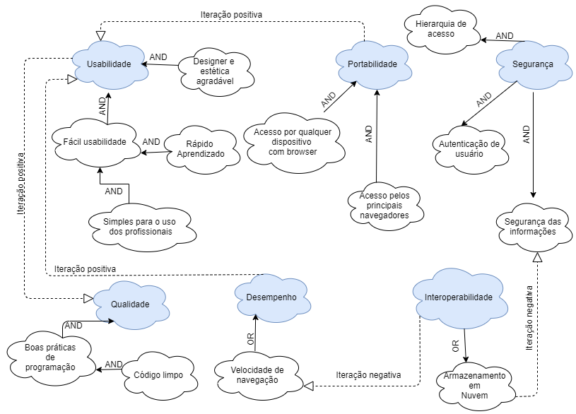

# Especificação suplementar 

## Histórico de Versões
| Data     | Versão   | Descrição | Autor(es) |
| --- | --- | --- | --- | 
| 08/09/2020 | 0.1 | Abertura do documento | Luis Marques e Pedro Henrique | 
| 09/09/2020 | 0.2 | Adição dos campos Confiabilidade, Portabilidade, Desempenho, Restrições de Design | Pedro Henrique Castro de Oliveira |
|10/09/2020|0.3| Tópicos 1,2,6,7 e 9| Luis Marques |
|10/09/2020|0.4| Formatação do documento | Luis Marques |
|11/09/2020|0.5| Adição do diagrama, tópico 8.3 e formatação | Luis Marques e Pedro Henrique |
|13/09/2020|0.6| Mudança no nome do arquivo para padronização, mudança no texto do tópico 1.1 e tópico 7 e correção de ortografia | Pedro Henrique Castro de Oliveira |

## 1. Introdução  

### 1.1 Finalidade 

Esse documento tem como objetivo esclarecer e evidenciar os requisitos não funcionais do sistema, deixando claro os atributos usabilidade, confiabilidade, portabilidade, desempenho, interoperabilidade, segurança e restrições de design, a fim de deixar a parte interessada e futuros desenvolvedores a par desses conceitos. Além de explicitar tudo que foi previamente definido com o cliente e não está listado no caso de uso.

### 1.2 Escopo 

Os requisitos e funcionalidades aqui especificados fazem parte do processo de desenvolvimento da aplicação eSaudeUNB, que tem como objetivo elaborar uma plataforma para melhorar o gerenciamento de prontuário e horários de profissionais da psicologia, e pacientes. Além da informatização e maior facilidade na observância de dados estatísticos sobre os atendimentos, por intermédio de um dashboard.

### 1.3 Definições, Acrônimos e Abreviações 
|Abreviatura|Significado|
| --- | --- |
| BI |Business Intelligence|
| MVC | Model-View-Controller|
|MC | Model-Controller|  
### 1.4 Referências 
AGUIAR, Carla Silva Rocha. Plataforma online para prontuário de atendimento fase de recuperação COVID-19. UNB, 2020. Disponível em: http://repositoriocovid19.unb.br/repositorio-projetos/plataforma-online-para-prontuario-de-atendimento-fase-de-recuperacao-covid-19/. Acesso em: 10 de set. de 2020 
## 2. Usabilidade  
Como ponto essencial para o projeto, temos que o software deverá ser de usabilidade fácil, de aprendizado rápido, e de uso simples para os profissionais. 
### 2.1 Metas de usabilidade 

* Intuitivo: para que se possa utilizar ao primeiro contato.  
* Pratico: para utilização no dia a dia dos profissionais.  
* Seguro: Proteção aos dados confidenciais de Pacientes e psicólogos.  
* Estável: para utilização em larga escala.  
## 3. Confiabilidade 

* O sistema deverá ter alto nível de confiabilidade devido a manipulação de informações particulares dos pacientes e o sigilo médico é algo essencial e que tem que ser garantido e priorizado. Pensando nisso, o sistema será baseado em hierarquia de acesso garantindo a seguridade dos dados.

## 4. Portabilidade 
* O sistema deverá funcionar nos principais navegadores de internet e em dispositivos capazes de acessar a internet, que suportem os browsers e ter uma alta taxa de escalabilidade para posteriormente adaptar o software para uma versão mobile.

## 5. Desempenho 
* O sistema deverá processar as requisições de acesso do usuário e cadastrar um atendimento de maneira eficiente e fluída, contribuindo para a qualidade dos atendimentos e uma boa experiência.

## 6. Interoperabilidade  
* O sistema possuirá um banco de dados, sendo acessível aos administradores do sistema remotamente.   
* O painel de BI estará acessível aos administradores á qualquer momento do dia,sendo atualizado em tempo real  
* o sistema ira armazenar os dados em nuvem, permitindo o acesso e manutenção do sistema remotamente.  

## 7. Segurança  

As Informações do prontuário serão acessíveis somente por psicólogos ou pode ser acessada pelo usuário paciente, desde que este solicite o prontuário formalmente.

## 8. Restrições de Design  

### 8.1 Interface 

* Amigável 
* Intuitiva 
* Informações objetivas 

### 8.2 Arquitetura 
* MVC 
  * A camada MC (Model-Controller) encontrada no back-end (Node.js + Express.js) e a View representada pelo React.js

### 8.3 Padrão de código

* Airbnb javaScript Style.

### 8.4 Ferramentas 

#### 8.4.1 Desenvolvimento 

* React.js 

* Node.js 

* Express.js 

* Postgress SQL 

* Axios 

* Jest 

* Docker 

#### 8.4.2 Gerenciamento 
* Slack 
* Google Drive 

## 9. Interfaces do Usuário  

o Sistema contara com as seguintes telas:  
* Login   
* Cadastro de Usuário Paciente   
* Cadastro de Usuário Psicólogo   
* Lista de Psicólogos   
* Lista de Horários de um psicólogo   
* Lista de Prontuário dos pacientes   
* Visualização de prontuário de um paciente   
* Tela de cadastro de novo atendimento   
* Informações complementares (quando o usuário estiver logado)   
* Calendário para marcação de consulta  
* Perfil de usuário  
* Perfil de psicólogo  
* Resumo de prontuário paciente  

## 10. Diagrama NFR 

 