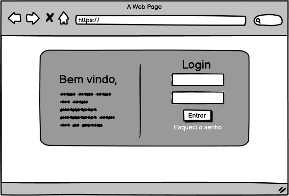
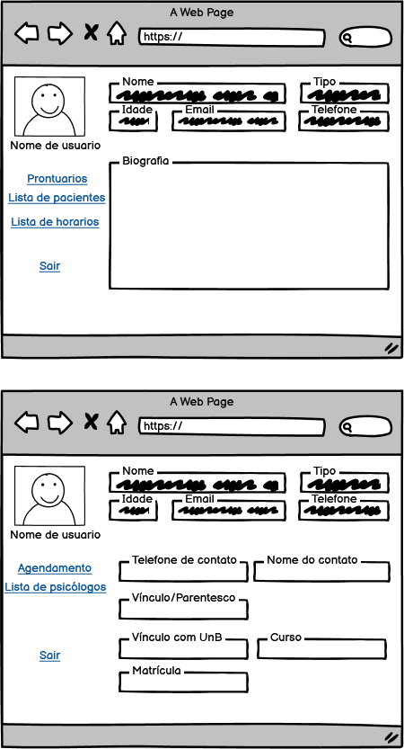
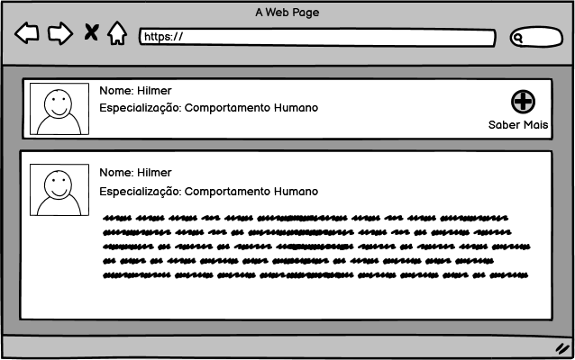
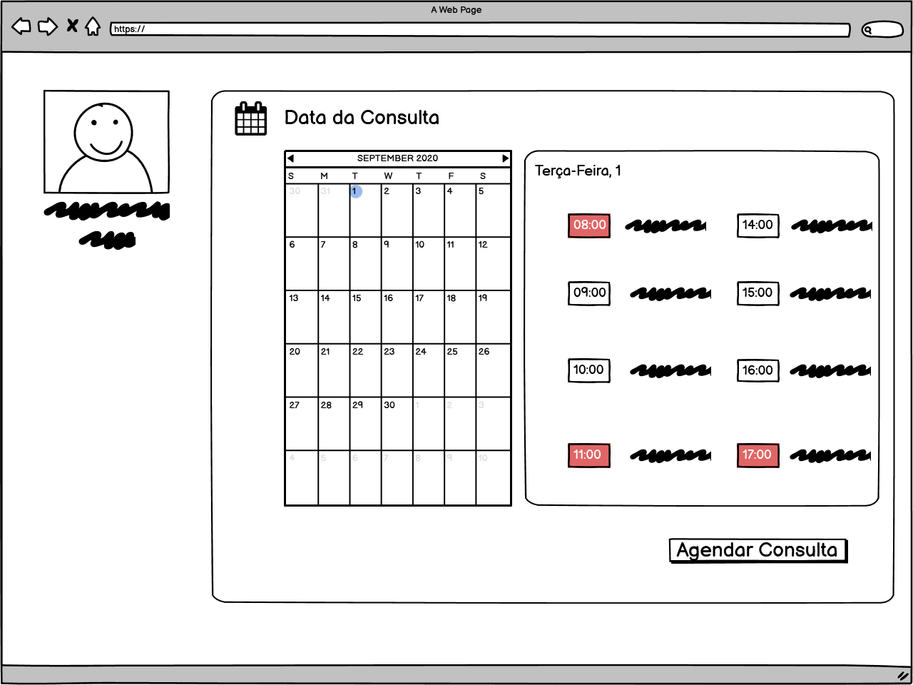
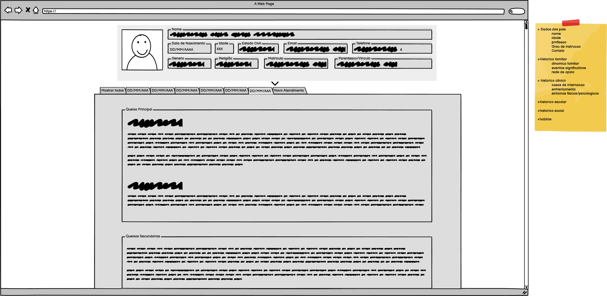

# Protótipo de Baixa Fidelidade

## Histórico de Versões
| Data     | Versão   | Descrição | Autor(es) |
| -------- | -------- | -------- | -------- |
| 07/09/2020 | 0.1  | Adição de todas as telas do protótipo de baixa fidelidade | Abner Filipe, Caio Martins, Luis Marques, Pedro Henrique, Rafael Leão, Vinicius Ferreira |

## 1. Login

## 2. Cadastro de Usuário Paciente e Usuário Psicólogo

### 2.1 Informações Complementares quando Logado

## 3. Lista de Psicologos

## 4. Lista de Horários de um psicólogo

## 5. Lista de prontuários dos pacientes

## 6. Visualização do prontuário de um paciente

## 7. Tela de cadastro de novo atendimento

