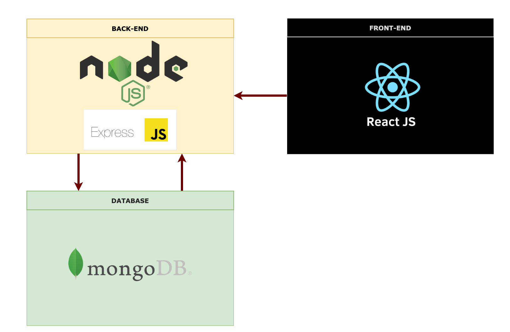
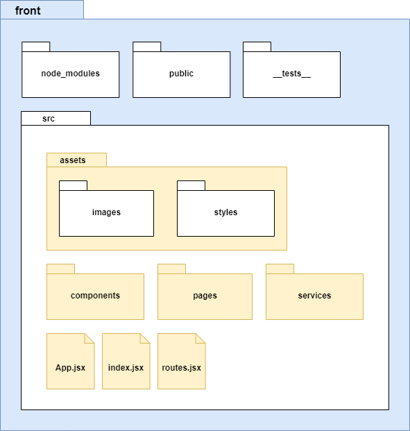
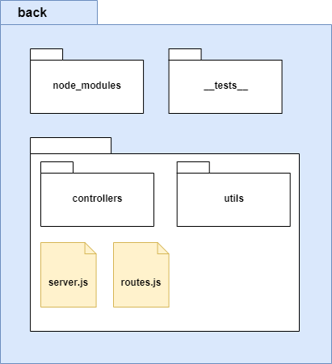
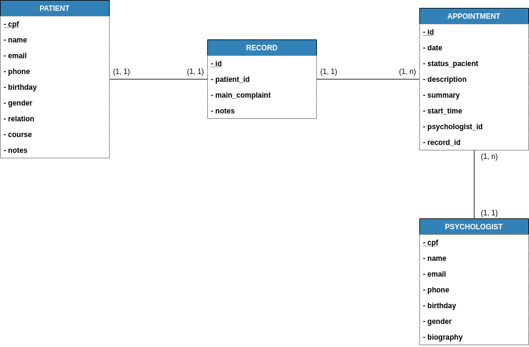

# Documento de Arquitetura

## Histórico de Revisão

| Data       | Versão | Descrição                    | Autores                    |
| ---------- | ------ | ---------------------------- | -------------------------- |
| 02/09/2020 | 0.1    | Abertura do documento        | Caio Martins               |
| 03/09/2020 | 0.2    | Representação da Arquitetura | Abner Filipe e Rafael Leão |
| 03/09/2020 | 0.3    | Introdução                   | Vinícius Ferreira Alves de Lima|
| 04/09/2020 | 0.4    | Implementação                | Luis Marques|
| 04/09/2020 | 0.5    | Metas e Restrições           | Pedro Henrique Castro de Oliveira |
| 06/09/2020 | 1.0    | Resumo Representação da Arquitetura | Abner Filipe e Rafael Leão |
| 07/09/2020 | 1.1    | Referências adicionadas | Vinícius Ferreira |
| 07/09/2020 | 1.2    | Arrumando formatação do campo Metas e Restrições | Pedro Henrique Castro de Oliveira |
| 12/09/2020 | 1.3    | Ajustando item 2 e 4.3 | Joberth Rogers Tavares Costa |
| 12/09/2020 | 1.4    | Corrigindo erros ortográficos | Joberth Rogers Tavares Costa |
| 16/09/2020 | 1.5    | Alterando o banco de dados para MongoDB e pequenas correções | Daniel, João Pedro e Joberth |

## 1 Introdução

### 1.1 Finalidade
Este documento tem como objetivo descrever a arquitetura do eSaúdeUnB. São descritos os serviços e APIs que serão utilizados no desenvolvimento, tal como suas utilidades. Também lista um modelo geral de organização dos arquivos.

### 1.2 Escopo
O eSaúdeUnB é um projeto de registro de prontuários feitos por psicólogos sobre seus pacientes e sessões. Também contará com agendamento, listagem de profissionais e de pacientes.

### 1.3 Acrônimos e Abreviações
| | |
|-|-|
| API | Application Programming Interface |
| REST | Representational State Transfer |
| MVC | Model, View and Controller |
| MC | Model and Controller |

## 2 Representação da Arquitetura

O modelo de arquitetura proposto nesse projeto é um modelo multicamada, onde é divido em três frentes principais:

- A camada de persistência, onde engloba o banco de dados não-relacional MongoDB.
- A camada de manipulação e tratamento de dados, usando o framework ExpressJS.
- Camada de visualização dos dados, responsável por renderizar todos os dados manipulados na camada de tratamento e lidar diretamente com o usuário final.

Para realizar a comunicação entre as camadas, será utilizado o modelo de arquitetura cliente-servidor, no qual há os fornecedores de recursos e os que consomem esses recursos disponibilizados. O servidor é um fornecedor de recurso, onde é uma camada intermediária responsável por lidar diretamente com os a camada de persistência e fornecer os dados manipulados para a camada View através do protocolo de comunicação HTTP. O Cliente nesse ecossistema usufrui dos dados fazendo requisições ao servidor e renderizando estes para os usuários que fizeram a requisição.   

* React.js

O Frontend do projeto usará a biblioteca ReactJS, pela grande comunidade que engloba o ecossistema dessa biblioteca. Além disso o ReactJS possui diversos componentes prontos que podem ser adicionados, o que ajuda bastante na agilidade do desenvolvimento. Essa biblioteca também conta com serviços para construção de PWA (progressive web application) de forma bastante simples e rápida. Englobado na arquitetura do projeto, o ReactJs será a camada de View responsável por lidar diretamente com o usuário.

* Node.js

Node.js é uma plataforma para construir aplicações web escaláveis de alta performance usando JavaScript do tipo server side, não dependendo de um browser para sua execução. Ele foi construído em cima da engine V8 que interpreta JavaScript, criado pela Google e usado em seu navegador, o Chrome.

* MongoDB

O banco de dados escolhido para o projeto foi o MongoDB, pela sua alta performance, a sua imensa comunidade em seu ecossistema e uma ótima documentação para sua implantação.

* Express js

Para a parte do Backend, será usado o framework express juntamente com o  nodeJs, pela sua grande performance e flexibilidade, onde o próprio desenvolvedor tem a liberdade de definir a arquitetura do projeto. O express conta com todo o sistema de gerenciamento de rotas, utilitários HTTPs e gerenciamento de middlewares, o que é de grande ajuda para desenvolver aplicações do tipo REST e aplicações WEBs monolíticas.

A responsabilidade desse framework é atuar como a camada de manipulação dos dados, sendo a API do projeto. A arquitetura usada no Backend será a MC, derivada da arquitetura MVC. Nesse caso não existe a View para essa camada, pois esta tem a única responsabilidade de fazer o interfaceamento e manipulação de dados entre a camada de persistência e View da projeto.

* Axios

Requisições HTTP são um dos principais recursos usados no desenvolvimento web e mobile, já que são necessárias para acessar o servidor de nossas aplicações, banco de dados, entre outros. 

Axios é um cliente HTTP, que funciona tanto no browser quanto em node.js. A biblioteca é basicamente uma API que sabe interagir tanto com XMLHttpRequest quanto com a interface http do node. Isso significa que o mesmo código utilizado para fazer requisições ajax no browser também funciona no servidor. Além disso, as requisições feitas através da biblioteca retornam uma promise, compatível com a nova versão do JavaScript - ES6.

* Jest

Criado pelo Facebook, Jest foi escolhido como framework de teste devido a sua rápida e fácil implementação. Pelo fato de seus testes rodarem em modo paralelo e possuir a função de coverage no próprio framework, a execução dos testes é mais ágil e não necessita da utilização de bibliotecas nem configurações adicionais para verificar cobertura do código.

## 3. Metas e Restrições

### 3.1. Metas

Criação de uma plataforma online para cadastro de psicólogos voluntários e geração de um prontuário eletrônico para pacientes em fase recuperação da COVID-19 ou com a saúde mental comprometida devido ao isolamento social.

### 3.2. Restrições

#### 3.2.1. Compatibilidade
* A plataforma deverá ser online, com suporte para os navegadores mais populares, portanto sendo necessário acesso à internet.

#### 3.2.2. Segurança:
* O sistema deverá ser seguro de modo que proteja os dados confidenciais do paciente garantindo o sigilo médico.

#### 3.2.3. Arquitetura: 
* Contará com uma interface bastante intuitiva
* Possuirá uma alta escalabilidade garantindo a facilidade de expansão do projeto. 
* Node.js foi a tecnologia escolhida para ser usada no back-end juntamente com o framework Express em modelo MC (Model-Controller) e a biblioteca React foi a escolha feita para o front-end. 
* O banco de dados escolhido para o projeto foi o PostgreSQL.
* Será usado o Axios devido ao seu funcionamento tanto no browser quanto em Node.js.
* A ferramenta Docker será utilizada para facilitar o desenvolvimento em um ambiente isolado e construído especialmente para a equipe.

## 4 Visão de Implementação

### 4.1 Visão Geral
A aplicação seguirá o padrão de implementação RESTful, isto é, seguiremos utilizando os princípios REST. Estilo de arquitetura em que cada aplicação web é um conjunto de recursos que representam um estado permitindo uma comunicação entre aplicações independente de sua implementação por meio do protocolo HTTP.

### 4.2 Pacotes de Design Significativos do Ponto de Vista da Arquitetura

#### 4.2.1 Front-End
O front-end será totalmente desenvolvido utilizando a biblioteca React, segue a estrutura de pacotes

#### 4.2.2 Back-End
Estrutura de pacotes do back-end

### 4.3 Modelagem de Dados

## 5 Visão de Implantação

A implementação do Software será realizado por etapas, visando a utilização do software durante o desenvolvimento de novas funções,possibilitando um uso antecipado de funções ja desenvolvidas.

## Referências
Node.js. Disponível em: https://nodejs.org/. Acesso em 07/09/2020.

React. Disponível em: https://reactjs.org. Acesso em 07/09/2020.

MongoDB. Disponível em: https://docs.mongodb.com/. Acesso em 16/09/2020.

Express. Disponível em: https://expressjs.com/pt-br/4x/api.html. Acesso em 07/09/2020.

Axios. Disponível em: https://github.com/axios/axios. Acesso em 07/09/2020.

Jest. Disponível em: https://jestjs.io/docs/pt-BR/getting-started. Acesso em 07/09/2020.

DIAS, Emílio. 4 Conceitos sobre REST que Qualquer Desenvolvedor Precisa Conhecer. Algablog, 2016.
Disponível em: https://blog.algaworks.com/4-conceitos-sobre-rest-que-qualquer-desenvolvedor-precisa-conhecer/. Acesso em: 07/09/2020.

