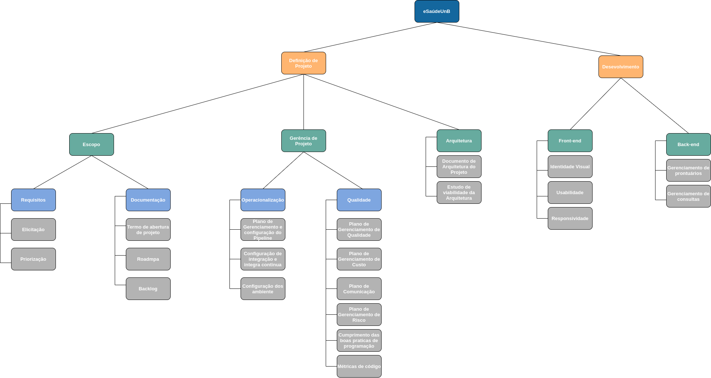

# Estrutura Analítica do Projeto

## Histórico de Versões
| Data     | Versão   | Descrição | Autor(es) |
|:----------:|:--------:|:----------------------:|:---------------------------:|
| 06/09/2020 |   0.1    | Estrutura Inicial da EAP |  Joberth Rogers  |

    De acordo com PMBOK 6° edição, a Estrutura Analítica de Projeto (EAP) é o processo de subdivisão das entregas e do trabalho do projeto em componentes menores e mais facilmente gerenciáveis. O principal benefício desse processo é que fornece uma visão estruturada do que deve ser entregue. Esse processo é realizado uma vez ou em pontos predefinidos no projeto.

