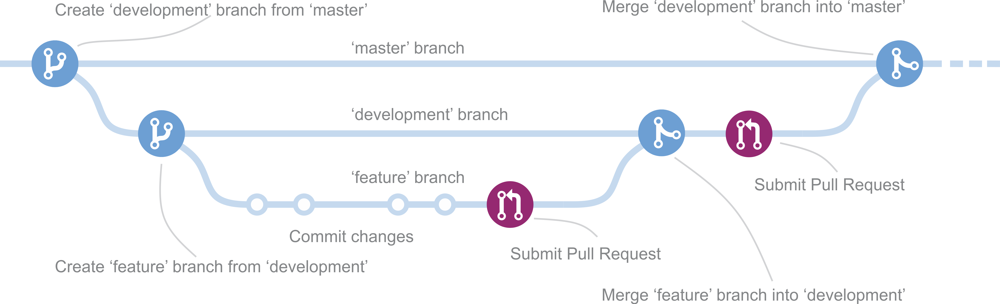

# Plano de Gestão e Configuração de Software

## Histórico de Versões
| Data     | Versão   | Descrição | Autor(es) |
|:----------:|:--------:|:----------------------:|:---------------------------:|
| 25/08/2020 |   0.1    | Criação do Documento de GCS           |   Daniel Maike, João Pedro, Joberth Rogers  |
| 26/08/2020 |   0.2    | Adequação dos Itens de Configuração          |   Daniel Maike, João Pedro, Joberth Rogers  |
| 26/08/2020 |   0.3    | Adequação das Políticas e do Uso de Issues          |   Daniel Maike, João Pedro, Joberth Rogers  |
| 26/08/2020 |   1.0    | Adequação do Repositório de Documentação e atualização de políticas de commit         |   Daniel Maike  |

## Sumário

[1. Introdução](#1-introducao)

[2. Itens de Configuração](#2-itens-de-configuracao)

[3. Políticas](#3-politicas)

[4. Uso de Issues](#4-uso-de-issues)

[5. Repositório de Documentação](#5-repositorio-de-documentacao)

[6. Referências](#6-referencias)

## 1. Introdução

* <p align = "justify">O presente documento tem como finalidade abordar os procedimentos de gerência e configuração de software a serem seguidos no projeto.</p>

## 2. Itens de Configuração

Serão tratados como itens de configuração para este projeto o código e a documentação que o acompanha. Descrimina-se abaixo os itens de configuração para os quais faremos a manutenção e gerenciamento.

* Documento: Arquivo de texto contendo planejamentos, descrição do produto e projeto, relatos de reunião ou do fluxo de projeto.
* Código: Artefato composto por um conjunto de arquivos de texto, contendo código de uma ou mais linguagens de programação ou marcação.

## 3. Políticas

### 3.1 Política de Commits

* <p align = "justify">Os commits devem ser criados logo em seguida à finalização de um conjunto conexo de alterações, descrevendo-o de forma sucinta e atômica. O formato deve conter o tipo do commit, a descrição e o id da issue no repositório do GitHub. O texto deve descrever o que foi produzido, de forma resumida e em inglês, com o tempo verbal no presente. Como no seguinte formato:

 [tipo do commit]: [resumo da alteração] <#id><br>

   * [tipo do commit] -> Tipo do Commit: feat | fix | docs | style | refactor | test | chore | perf | ci | build | temp<br>
   * [resumo da alteração] -> Resumo da alteração no tempo presente. Não capitalizado. Sem ponto final.<br>
   * <#id> -> Id da issue no repositório do GitHub<br>

Tipos:
   - feat: para uma nova feature<br>
   - fix: para bug fix<br>
   - docs: documentação apenas mudanças<br>
   - style: mudanças que não afetam o significado do código (espaço em branco, formatação, ponto e vírgula ausente, etc)<br>
   - refactor: uma mudança de código que não corrige um bug nem adiciona um recurso<br>
   - test: adicionar testes ausentes ou corrigir os existentes<br>
   - chore: mudanças no processo de construção ou ferramentas auxiliares e bibliotecas, como geração de documentação<br>
   - perf: uma mudança de código que melhora o desempenho<br>
   - ci: mudanças em seus arquivos e scripts de configuração de CI<br>
   - temp: commit temporário que não será incluído em seu CHANGELOG<br>

* Exemplo:

   ```feat: create user structure```

</p>

* Commits devem ser redigidos no idioma inglês.
* Devem ser simples e concisos, possuindo títulos curtos.
* Commits devem descrever o que está sendo alterado, se houver mais de uma alteração (pertinente ao commit) ela deve ser adicionada na descrição do commit.
* Devem iniciar com letras minúsculas.
* Devem iniciar com um verbo no presente, informando seu objetivo. Ex: "feat: create new main page"

### 3.2 Política de Branches

<br>

[](img/branches.png)

<br>

* <p align = "justify">O repositório do projeto terá uma branch principal, sendo ela a branch estável, a <i>master</i>.</p>

* <p align = "justify">A <i>master</i> será a branch estável do projeto, sendo ela proveniente da <i>develop</i> quando o pull request for aprovado, ao fim de cada release ou quando houver necessidade. Nenhum membro será autorizado a fazer commits diretamente na <i>master</i>.</p>

* <p align = "justify">As branches auxiliares são para a resulução de issues do projeto. Cada <i>User Story</i>, <i>Technical Story</i>, <i>HotFix</i> ou <i>BugFix</i> terá sua própria branch, criada a partir da <i>develop</i>, e terá como nomenclatura o seguinte padrão: </p>

   ``` feature/US[ID da User Story]-[Nome representativo da US] ``` ou <br>
   ``` feature/TS[ID da Technical Story]-[Nome representativo da TS] ``` ou <br>
   ``` bugfix/[Nome representativo do Bug Fix] ``` ou <br>
   ``` hotfix/[Nome representativo do Hot Fix] ``` <br>

* As branches <i>develop</i> e <i>master</i> têm papel importante no fluxo seguido. Portanto, nenhuma dessas deve receber um commit diretamente pelo time de desenvolvimento de nenhum <i>User Story</i>, <i>Technical Story</i>, <i>HotFix</i> ou <i>BugFix</i>.

* Para cada ISSUE uma nova branch deve ser criada com base no último commit da <i>develop</i>, de acordo com o modelo acima.
  
#### 3.2.1 Conflitos

Se um <i>Pull Request</i> causar algum tipo de conflito, deve ser resolvido primeiro pela equipe que desenvolveu o que está causando conflito, prezando pela integridade e organização do histórico de commits, e então deve ser refeito o pedido para avaliação do merge.

### 3.3 Política de Aprovação do Código

* <p align = "justify"> Para a aprovação do código, este deve ser aprovado por ao menos dois membros da equipe de Engenharia de Produto de Software.</p>

## 4. Uso de Issues

* <p align = "justify"> As issues serão criadas com o objetivo de mapear as <i>User Story</i>, <i>Technical Story</i>, <i>HotFix</i> ou <i>BugFix</i>, tendo assim um maior controle sobre elas. Com isso, conseguiremos manter o rastro dos commits com suas respectivas issues.</p>

* <p align = "justify"> As issues serão divididas em labels, para que se possa indicar sua natureza.</p>

* <p align = "justify"> O padrão do nome das issues terá o seguinte formato: </p>

   ``` US<ID incremental> - <Descrição da Issue>``` <br>
   ``` TS<ID incremental> - <Descrição da Issue> ``` <br>
   ``` BUGFIX - <Descrição da Issue> ``` <br>
   ``` HOTFIX - <Descrição da Issue> ``` <br>

* Exemplo : "US02 - Criar Termo de Abertura do Projeto (TAP)". <br>

* <p align = "justify"> E cada descrição de Issue deverá seguir o Issue Template determinado no repositório.</p>

* <p align = "justify"> Qualquer alteração deve ser solucionada apenas após a criação de uma issue especificando a alteração.</p>

## 5. Repositório de documentação

O repositório de documentação é encontrado na [wiki](#https://github.com/fga-eps-mds/2020.1-Grupo1-Wiki) do projeto. Seu objetivo é armazenar a documentação proveniente do projeto, bem como, as práticas adotadas pela equipe de desenvolvimento.

### 5.1 Versionamento de documentos

A versão dos documentos deve seguir o versionamento semântico MAJOR.MINOR. Uma alteração que envolva correção ou validação de um documento e que não exija esforço intelictual moderado, deve ser versionado incrementando o dígito MINOR. Para alterações que envolva adição de conteúdo ou correções significativas, deve ser incrementado o dígito MAJOR.

## 6. Referências

* PMI. Um guia do conhecimento em gerenciamento de projetos. Guia PMBOK® 5a. ed. - EUA: Project Management Institute, 2013

* QueroCultura. Plano de Gerenciamento de Configuração. Disponível em <https://github.com/fga-eps-mds/2017.2-QueroCultura/wiki/Plano-de-Gerenciamento-de-Configura%C3%A7%C3%A3o>