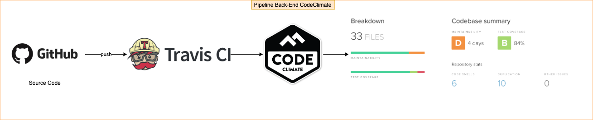
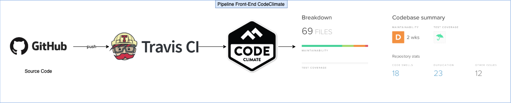
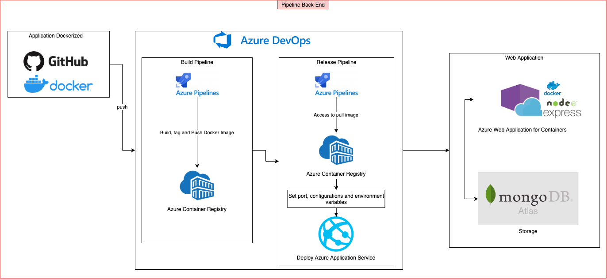
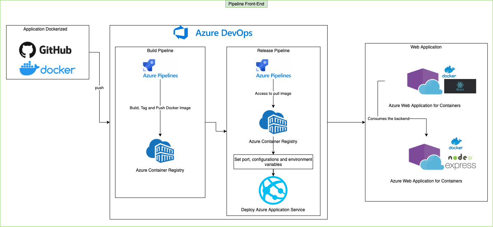

# Plano de Pipeline

## Histórico de Versões
| Data     | Versão   | Descrição | Autor(es) |
|:----------:|:--------:|:----------------------:|:---------------------------:|
| 27/09/2020 |   0.1    | Criação do Plano de Pipeline |   Daniel Maike  |

## 1. Ferramentas

### 1.1 Azure DevOps

O Azure DevOps Server é um produto da Microsoft que fornece controle de versão, relatórios, gerenciamento de requisitos, gerenciamento de projetos, builds automatizados, testes e recursos de gerenciamento de versão. Ele cobre todo o ciclo de vida do aplicativo e habilita os recursos do DevOps.

#### 1.1.1 Azure Container Registry

O Azure Container Registry fornece armazenamento de imagens de contêiner Docker privadas, permitindo recuperação rápida e escalonável e implantação de fechamento de rede de cargas de trabalho de contêiner no Azure.

#### 1.1.2 Azure Web Application for Containers

O Serviço de Aplicativo do Azure permite que você crie e hospede aplicativos Web, back-ends de dispositivos móveis e APIs RESTful na linguagem de programação de sua escolha sem gerenciar a infraestrutura. Eles oferecem o dimensionamento automático e alta disponibilidade, compatível com Windows e Linux e permite implantações automatizadas do GitHub, Azure DevOps ou qualquer repositório Git.

O Aplicativo Web para Contêineres fornece uma maneira flexível de usar imagens do Docker.

### 1.2 Travis CI

Como uma plataforma de integração contínua, o Travis CI oferece suporte ao seu processo de desenvolvimento, criando e testando automaticamente as alterações de código, fornecendo feedback imediato sobre o sucesso da alteração. O Travis CI também pode automatizar outras partes do seu processo de desenvolvimento, gerenciando implantações e notificações.

### 1.3 Code Climate

Code Climate é uma plataforma hospedada para medir e monitorar continuamente a qualidade do código.

Ele fica de olho na qualidade geral do código , mas também pode rastrear a cobertura do teste.

### 1.4 Docker

Docker é um conjunto de produtos de plataforma como serviço que usam virtualização de nível de sistema operacional para entregar software em pacotes chamados contêineres. Os contêineres são isolados uns dos outros e agrupam seus próprios softwares, bibliotecas e arquivos de configuração.

### 1.5 GitHub

GitHub é uma plataforma de hospedagem de código-fonte com controle de versão usando o Git.

### 1.6 MongoDB Atlas

MongoDB Atlas é o serviço de banco de dados em nuvem global para aplicativos modernos. Implante o MongoDB totalmente gerenciado na AWS, Azure ou GCP. As melhores práticas e automação da categoria garantem disponibilidade, escalabilidade e conformidade com os mais exigentes padrões de segurança e privacidade de dados.

## 2. Pipeline Back-End - Code Climate

## 3. Pipeline Front-End - Code Climate

## 4. Pipeline Back-End - CI/CD

## 5. Pipeline Front-End - CI/CD

## 6. Referências

* https://docs.travis-ci.com/user/code-climate/

* https://docs.travis-ci.com/

* https://docs.codeclimate.com/docs

* https://azure.microsoft.com/pt-br/services/devops/

* https://docs.microsoft.com/pt-br/azure/?product=featured

* https://www.mongodb.com/cloud/atlas

* https://docs.docker.com/
