# Protótipo de alta fidelidade

## Introdução

Este documento tem como propósito apresentar o protótipo de alta fidelidade de forma que a parte visual seja o mais próximo possível do produto final.

## Landing Page

[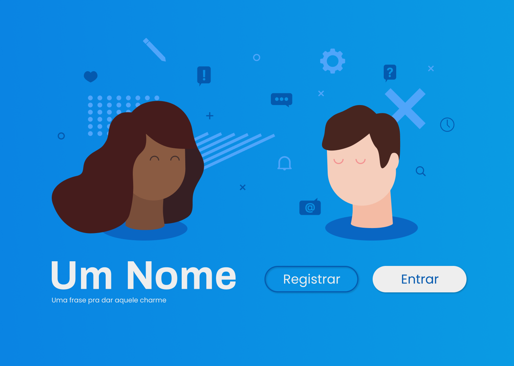](img/landingPage.png)

A Landing Page será a página inicial do projeto. Nela o usuário terá uma breve apresentação do eSaude e ainda poderá fazer o Login e se cadastrar na plataforma.

## Login

Após cadastrado o usuário poderá logar e fazer o uso das funcionalidades do site.

## Registrar-se

[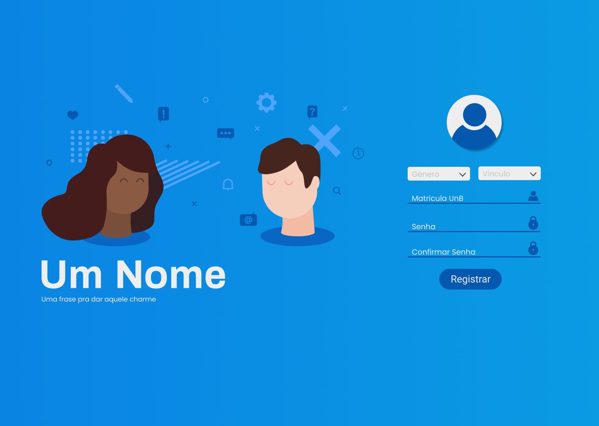](img/signUP_02.png)

Usuário poderá se cadastrar com algumas informações básicas e indicando o seu vínculo com a UnB, e para deixar de uma fora mais amigável ao usuário, quebramos em 2 etapas o cadastro

## HomePage Psicólogo

Nessa página o psicólogo poderá consultar os eventos agendados conforme o dia que quiser, bem como acessar seu perfil e a lista de pacientes cadastrados na plataforma.

## HomePage Usuário

[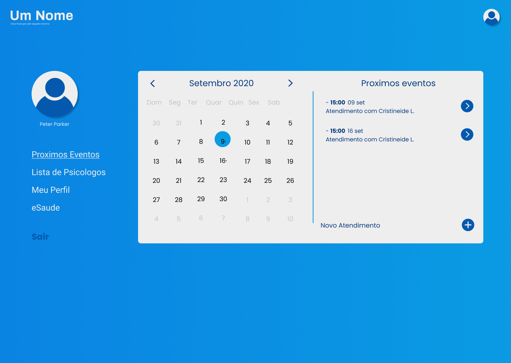](img/userMain.png)

Nessa página o usuário poderá consultar os atendimentos agendados conforme o dia que quiser, bem como acessar seu perfil e a lista de psicólogos cadastrados na plataforma.

## Novo Atendimento (Erro)

[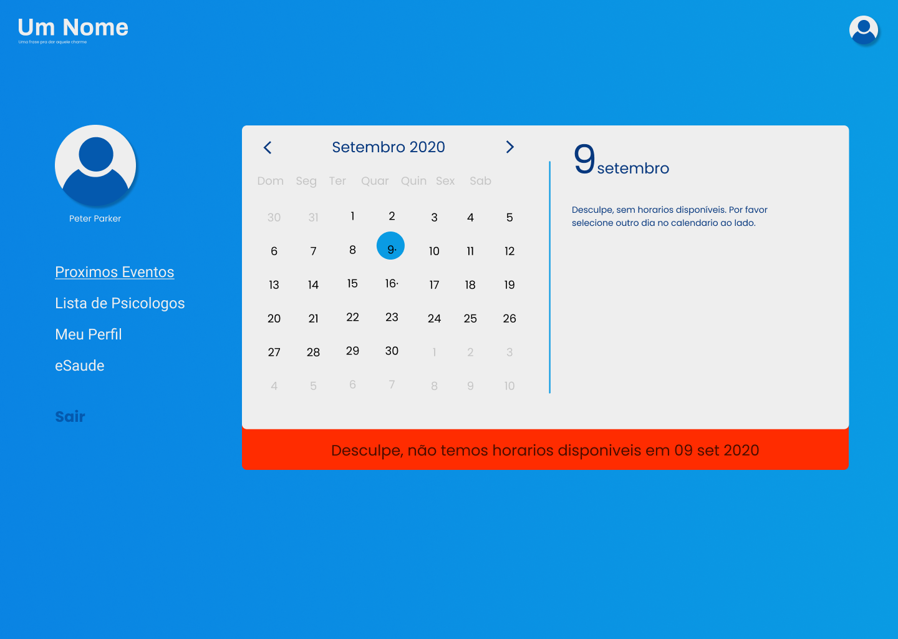](img/userNewAtmErr.png)

O usuário ao selecionar um dia que não possui atendimentos disponíveis receberá uma mensagem de erro indicando a falta de horários disponíveis.

## Novo Atendimento (Sucesso)

[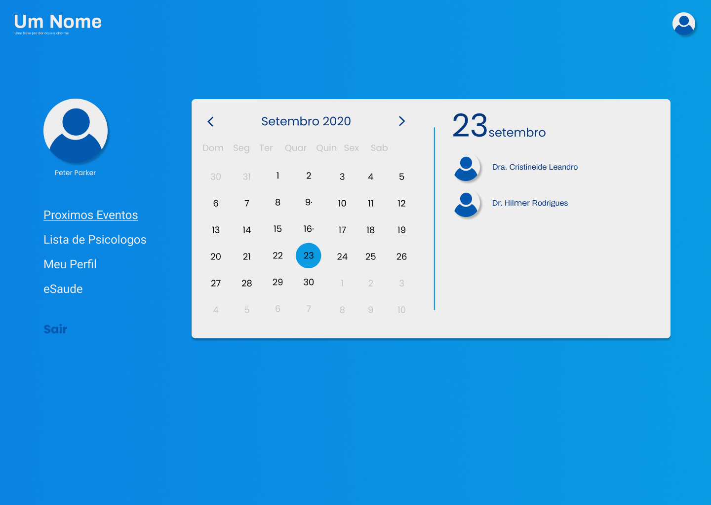](img/userNewAtm.png)

[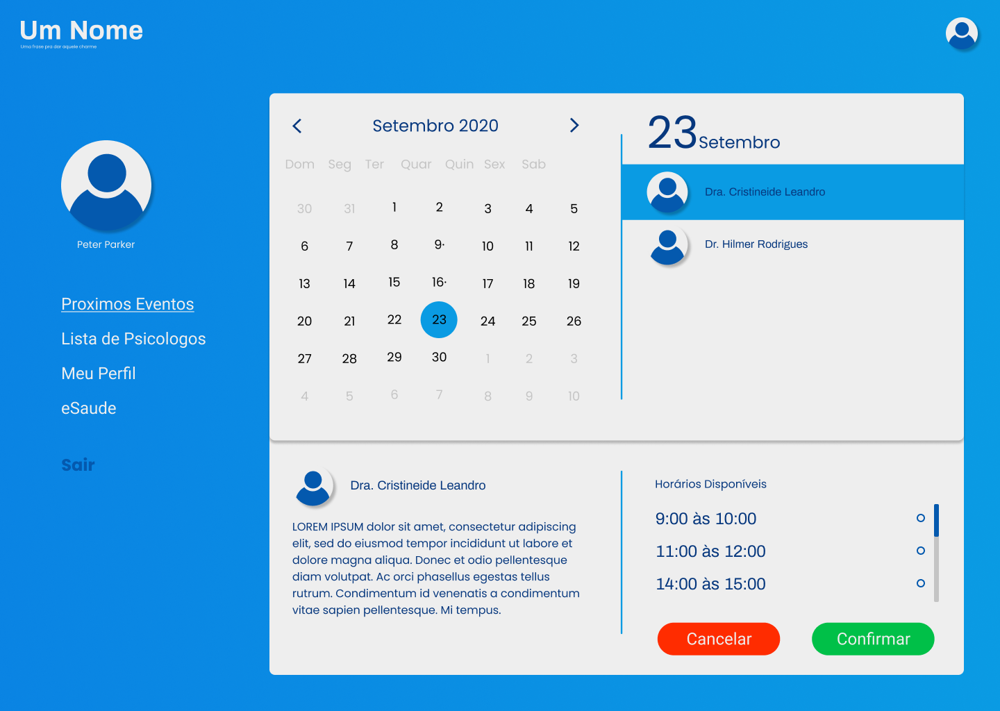](img/userNewAtm_02.png)

Será exibido a lista de psicólogos disponíveis de acordo com o dia escolhido, e ao clicar em determinado psicólogo será exibido os horários dele para aquele determinado dia.

## Lista de Psicólogos

[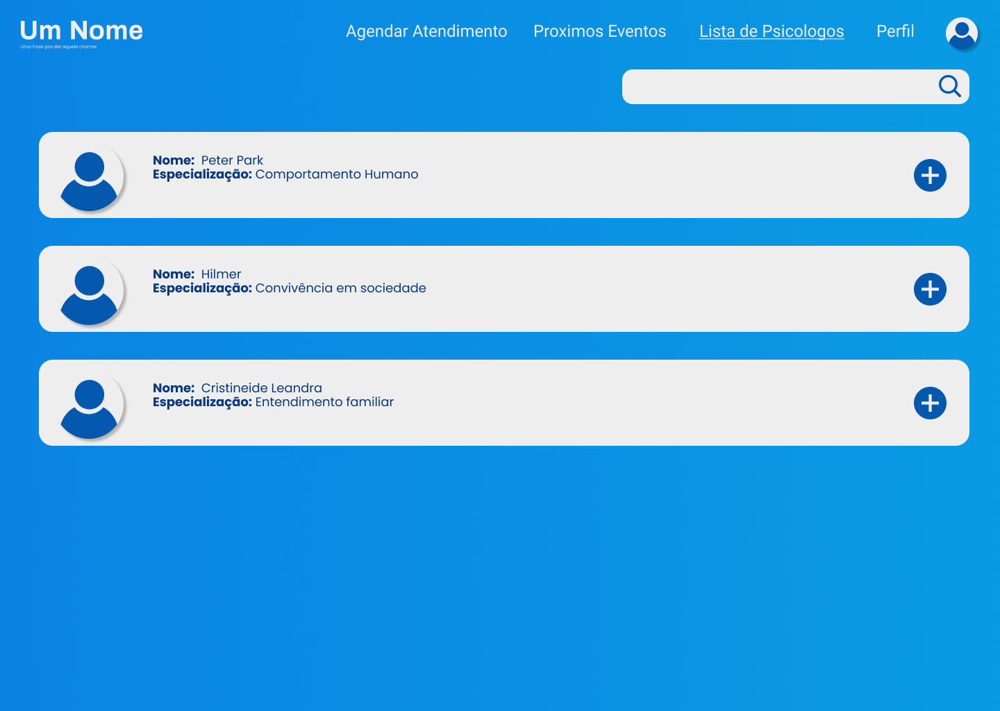](img/psychologistList.png)

[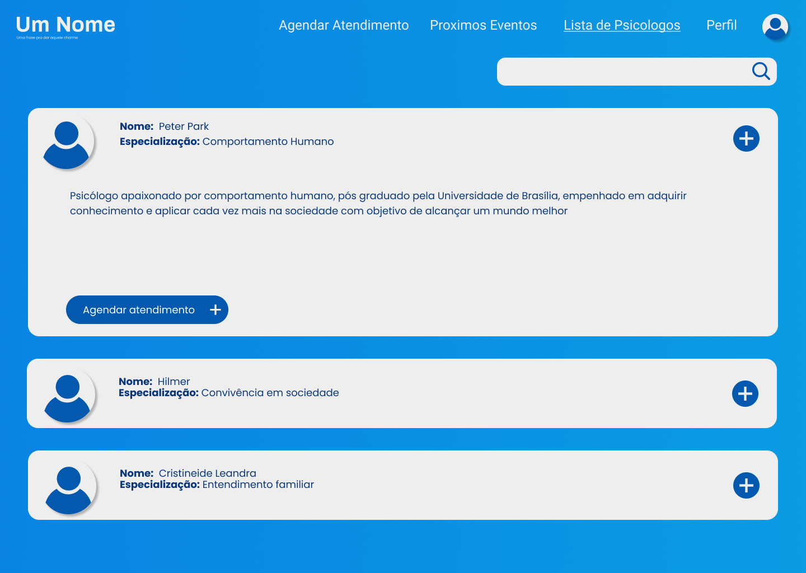](img/psychologistList_2.png)

Lista de psicólogos cadastrados no site e sua biografia.

## Lista de Pacientes

O psicólogo poderá consultar o resumo de cada paciente cadastrado no site, e também pesquisar um específico

## Resumo do Paciente

Resumo de um paciente escolhido

## Resumo do Paciente(02)

[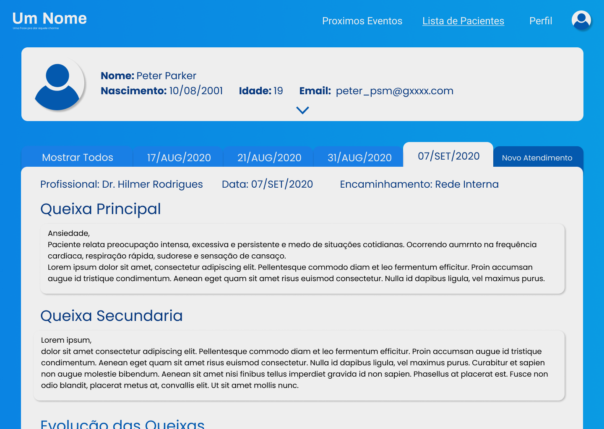](img/patientResumeShow.png)

Resumo do paciente de determinado dia

## Cadastro de atendimento realizado

[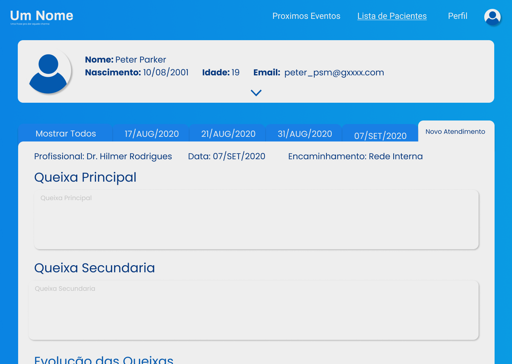](img/patientResumeNewResume.png)

Cadastro de um atendimento realizado pelo psicólogo.

## Perfil do Psicólogo

[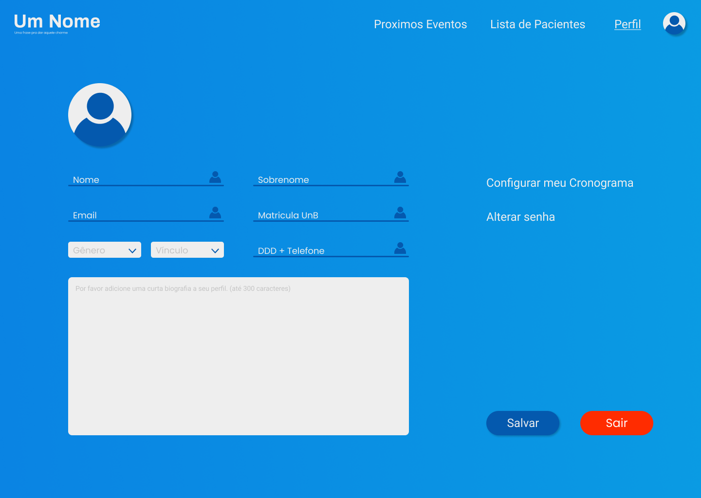](img/psychologistProfile.png)

Através do perfil do psicólogo será possível relizar a alteração da bio exibida, configuração do cronograma e algumas informações pessoais.

## Perfil do Usuário

[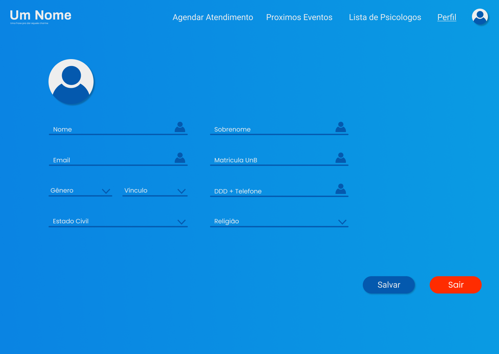](img/userprofile.png)

Através do perfil do usuário será possível fazer algumas alterações de informações pessoais.