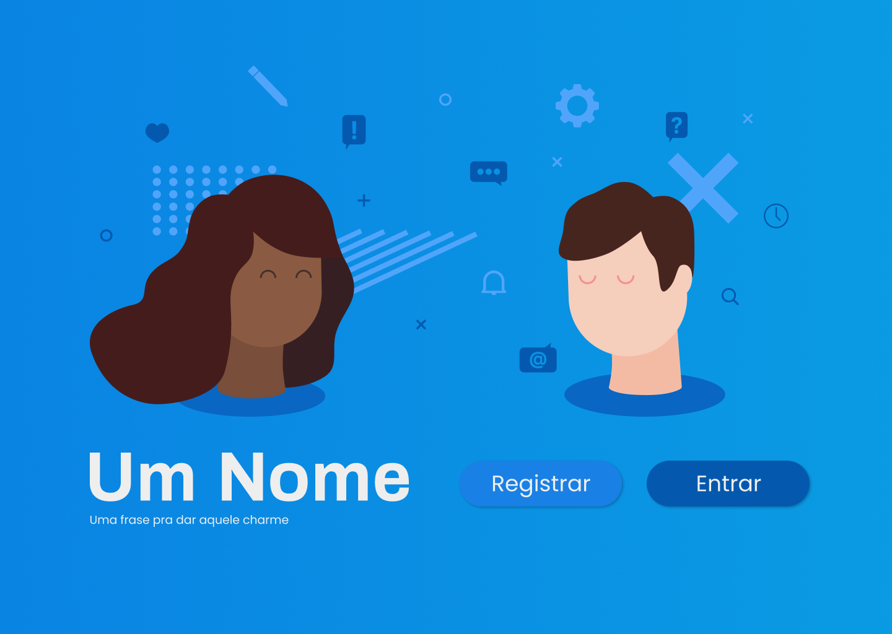
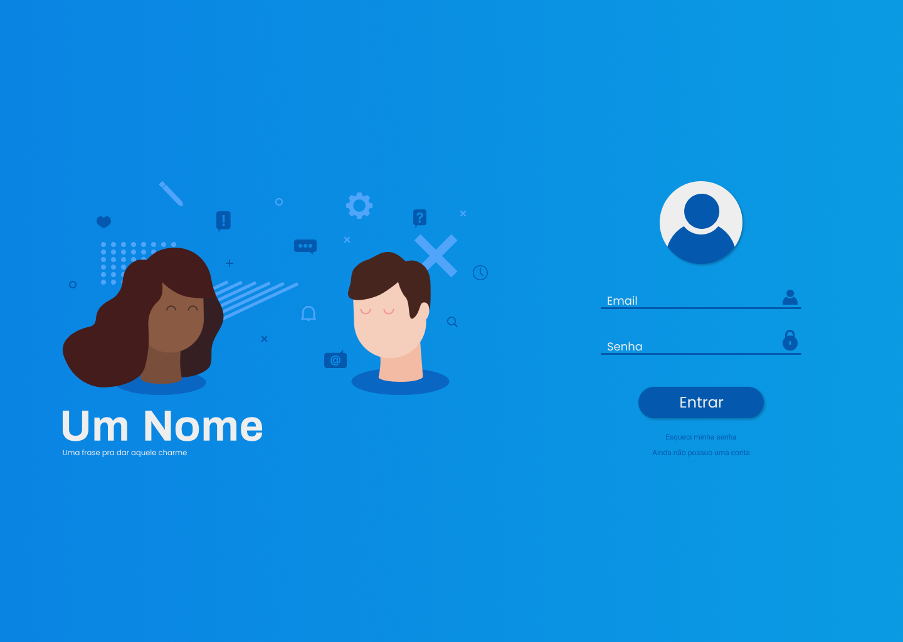
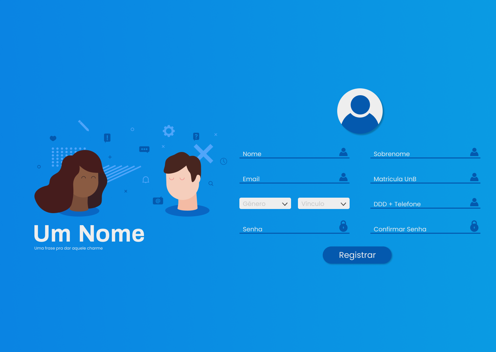

# Protótipo de alta fidelidade

## Introdução

Este documento tem como propósito apresentar o protótipo de alta fidelidade de forma que a parte visual seja o mais próximo possível do produto final.

## Landing Page

A Landing Page será a página inicial do projeto. Nela o usuário terá uma breve apresentação do eSaude e ainda poderá fazer o Login e se cadastrar na plataforma.

## Login

Após cadastrado o usuário poderá logar e fazer o uso das funcionalidades do site.

## Registrar-se

Usuário poderá se cadastrar com algumas informações básicas e indicando o seu vínculo com a UnB.

## HomePage Psicólogo

Nessa página o psicólogo poderá consultar os eventos agendados conforme o dia que quiser, bem como acessar seu perfil e a lista de pacientes cadastrados na plataforma.

## HomePage Usuário

Nessa página o usuário poderá consultar os atendimentos agendados conforme o dia que quiser, bem como acessar seu perfil e a lista de psicólogos cadastrados na plataforma.

## Novo Atendimento (Erro)

O usuário ao selecionar um dia que não possui atendimentos disponíveis receberá uma mensagem de erro indicando a falta de horários disponíveis.

## Novo Atendimento (Sucesso)

Será exibido a lista de psicólogos disponíveis de acordo com o dia escolhido, e ao clicar em determinado psicólogo será exibido os horários dele para aquele determinado dia.

## Lista de Psicólogos

Lista de psicólogos cadastrados no site e sua biografia.

## Lista de Pacientes

Lista de pacientes cadastrados no site.

## Perfil do Psicólogo

Através do perfil do psicólogo será possível relizar a alteração da bio exibida, configuração do cronograma e algumas informações pessoais.

## Perfil do Usuário

Através do perfil do usuário será possível fazer algumas alterações de informações pessoais.