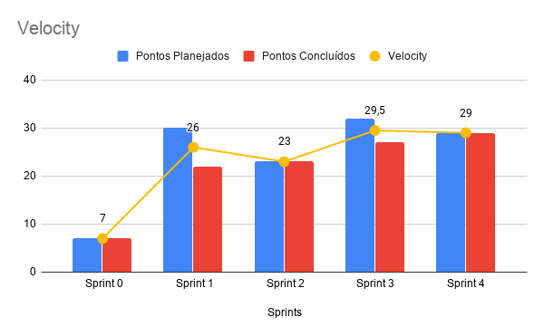
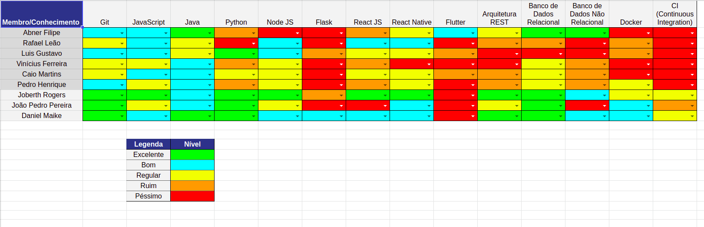

# Resultado Sprint 4

    Nessa <i>sprint</i>, todos os membros de MDS pegaram histórias envolvendo código. Foi um marco importante dentro do projeto, sendo a primeira experiência com código compartilhado do time de desenvolvimento, tendo estes que corrigir problemas oriundos ao trabalho paralelo, uso do pair programming, e aprendizado mais intenso das tecnologia do projeto. O time de gerênciamento resolveu acompanhar mais de perto o time de MDS nos primeiros dias da <i>sprint</i>, para verificar a dificuldade das duplas com as <i>issues</i> e fazer um pareamento inicial para ajudar no alinhamento de conhecimento do time que está começando.

## Fechamento da Sprint

| Issues | Pontos |
| ------ | ------ |
| US02 - Implementação do Usuário Administrador | 8 |
| US03 - Implementação da edição do usuário paciente | 8 |
| US04 - Implementação do prontuário de paciente | 8 |
| Elaboração do Planejamento de Risco | 3 |
| Burndown de Risco | 2 |

 

**Total de pontos planejados:** 29
 

**Pontos planejados concluídos:** 29
 

## Burndown

## Velocity

## Quadro de conhecimento

### Retrospectiva

### Pontos Positivos

- Duplas Rafael e Caio, Luís e Vinicius conseguiram parear 100% do tempo da sprint.
- Paciência em ensinar o colega do pareamento.
- Ajuda da dupla que está pareando.

### Pontos Negativos

- Sobrecarga de membros (Abner).
- Comunicação entre a dupla Abner e Pedro não foi muito eficaz.
- Falta de domínio das tecnologias.
- Falta de experiência em Design.

### A melhorar

- Dedicação maior a disciplina e ao projeto.
- Padronização de código.
- Mais atenção a erros menores e mais recorrentes na hora de abrir o PR.
- Gerênciar melhor o tempo.
- Melhorar a comunicação entre as duplas.

## Avaliação do Scrum Master

    Nessa semana, o time de EPS esteve bem mais focado, ambos os membros do time de gerência estavam disponíveis para tirar dúvidas e fazer as correções dos Pull Requests o mais rápido possível. Em questão das melhorias levantadas na <i>sprint</i> passada referente ao foco do time de gerência, o problema foi totalmente mitigada nessa semana. Além disso, alguns membros do time de desenvolvimento teve a primeira experiência de código, onde no começo da semana algumas duplas de pareamento estavam um pouco perdidas referente ao escopo das issues, mas o time de gerênciamento conseguiu solucionar as principais dúvidas e as issues andaram normalmente no decorrer da <i>sprint</i>.

    O único problema nessa semana, foi as histórias serem terminadas novamente em cima da hora. Muitas das correções foram feitas no ultimo dia da <i>sprint</i>, mas todas as issues planejadas foram terminadas e entregues. Não houve nenhuma dívida técnica, o que é muito bom para o andamento do projeto. Além do mais, o documento de gerênciamento de risco foi criado pelo time de EPS, logo tentar mitigar os riscos levantados ficará bem mais fácil, já que ambos estão mais claros dentro da gerência. 

