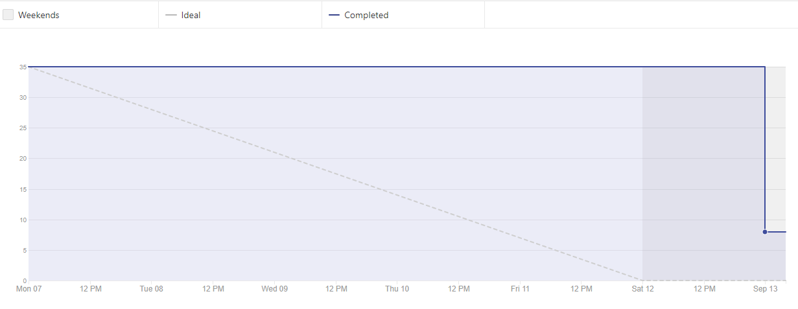
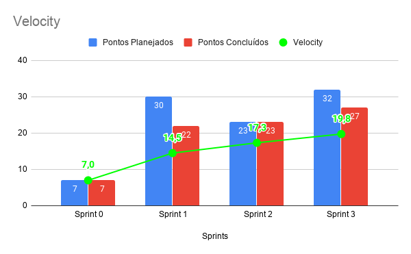
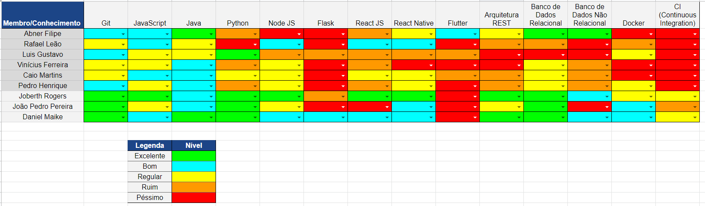

# Resultado Sprint 3

    Para essa Sprint foi planejado a primeira US envolvendo código, que foi designado ao time de MDS. Mesmo com apenas uma dupla nessa frente, foi possível enxergar alguns pontos no qual o time de EPS deve ter cuidado na hora das correções envolvendo esse tipo de história. Foi uma Sprint boa para o time em geral, tendo apenas uma divida técnica e sendo por parte do time de EPS, o que mostra o empenho da equipe em entregar o máximo de pontos planejados na Sprint, principalmente o time de MDS.

## Fechamento da Sprint

| Issues | Pontos |
| ------ | ------ |
| Especificação Suplementar | 8 |
| Prototipo de alta fidelidade | 5 |
| US01 - Implementação do Usuário Paciente | 8 |
| Plano de Metodologia e Papeis | 3 |
| Deploy Continuo | 5 |
| Plano de Comunicação | 3 |

 

**Total de pontos planejados:** 32
 

**Pontos planejados concluídos:** 27
 

## Burndown

## Velocity

## Quadro de conhecimento

    Sendo esta a primeira Sprint envolvendo código para o time de MDS, não foi possível notar alguma melhora significante para os membros, pois apenas uma dupla ficou responsável pela issue de código. A próxima Sprint de acordo com o RoadMap, terá issues de código para ambas as duplas e possivelmente o quadro de conhecimento tenha alguma melhora significante, já que com o pareamento estratégico criado pelo time de EPS, o conhecimento das tecnologias circulará mais entre o time de desenvolvimento, nivelando as habilidades no grupo. Para o time EPS, não houve muita melhora, pois essa sprint foi voltada exclusivamente para configuração de ambiente, habilidade que já era conhecida pela maioria do time de gerência.

### Retrospectiva

### Pontos Positivos

- As issues em que algumas duplas estavam trabalhando foram feitas rapidamente para receber feedbacks e foi melhorando no decorrer da semana.
- A equipe conseguiu entregar as principais issues.

### Pontos Negativos

- Trabalho das issues andaram muito rápidas no inicio e depois alguns membros se sentiram saturados e com dificuldade para continuar.
- Duplas não tinha conhecimento a respeito da issue, sendo um pouco difícil de acompanhar no inicio.
- Sobrecarga de outra disciplina e do trabalho.
- Faltou proatividade da equipe de MDS e faltou empenho dos membros de EPS na correção dos PRs.
- Melhorar organização para entrega das issues com mais rapidez para poder ter mais feedback e menos sobrecarga de outras matérias.
- Dificuldades com código e principalmente com a parte de testes.

### A melhorar

- Ter mais calma com o trabalho.
- Melhorar cronograma para contribuir melhor para o projeto.
- Proporcionar mais ajuda para a equipe de MDS.
- Correção mais rápida com os PRs, e proatividade com a equipe de MDS.
- Melhorar conhecimentos de docker.

## Avaliação do Scrum Master

    Apesar de não ter entregado a issue de integração continua, devido aos problemas encontrados com os ambiente de desenvolvimento, a equipe conseguiu entregar com eficiência as outras tarefas planejadas, além de ter aumento significativo na comunicação de todos os membros. Os canais de duvidas vem sendo frenquentemente usados pelo time de MDS, o que torna os problemas para o time de gerência mais claros e fáceis de serem mitigados antes do termino da Sprint. O time de EPS também incentivou o pessoal de desenvolvimento a pesquisar mais sobre os erros encontrados, pois caso nenhum dos membros possa ajudar no momento da dúvida, a dupla não fique ociosa e aprende a lidar com os erros básico das tecnologias do produto.  

    Vale a pena destacar que o time de EPS estava desfocado nessa Sprint, pois ambos Pull Requests foram revisados muito tarde, o que é um risco para o projeto, podendo estes tornarem dividas técnicas e atrapalhar o RoadMap do projeto. A equipe de gerência concordou que teve esse desfoque e que essa falha deve ser mitigada com dedicação maior a disciplina. 

