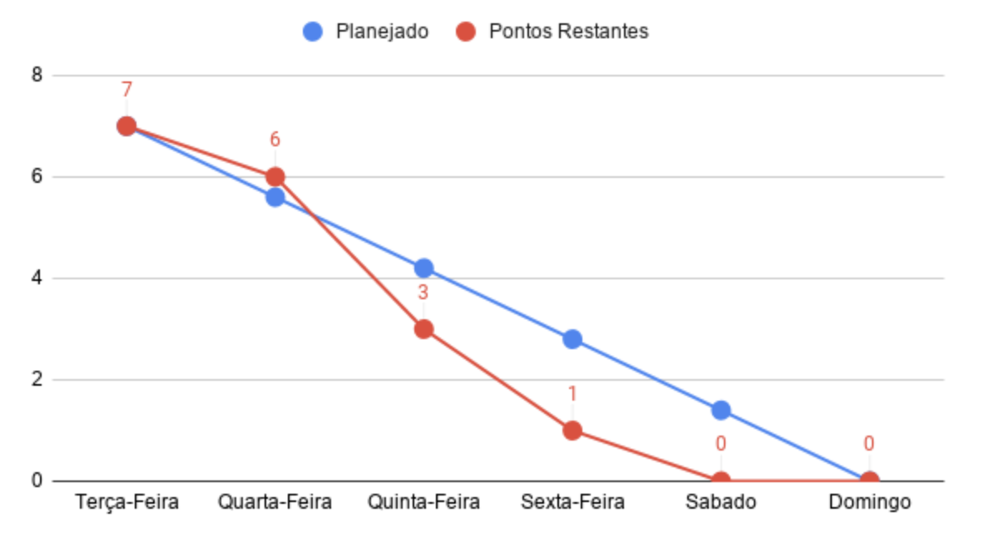
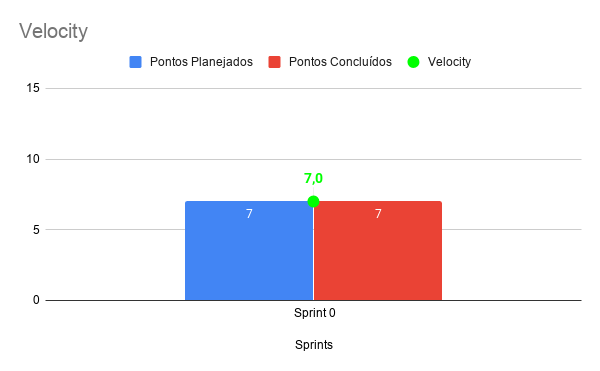

# Resultado Sprint 0

Essa Sprint foi dedicada exclusivamente para a definição de um tema para o time de EPS e MDS, onde a ideia inicial foi oferecida pela professora Carla. Essa semana também foi marcada pelo contato inicial com os clientes e equipe de MDS.

## Fechamento da Sprint

| Issues | Pontos |
| ------ | ------ |
| Definição de Tema | 2 |
| Definição de papeis (EPS) | 1 |
| Criação do quadro de conhecimento | 1 |
| Configuração dos canais de comunicação | 1 |
| Configuração do repositório | 1 |
| Definição da Metodologia | 1 |

**Pontos planejados concluídos:** 7

## Burndown

## Velocity

## Quadro de conhecimento inicial

    Pela falta de clareza na visualização do produto nessa primeira sprint, hove uma pequena dificuldade na criação do quadro de conhecimento. A escolha das tecnologias certas dependeria muito das features que seriam criadas no decorrer do desenvolvimento, logo a equipe de EPS elaborou um quadro de conhecimento abordando as tecnologia mais conhecidas e que a curva de aprendizagem fosse menor, levando em consideração a alta quantidade e qualidade de conteúdos fornecidos pelas comunidades da internet. 

    Com esse quadro foi possível ter um overview das habilidades de ambos os times desse projeto, e servirá como referência inicial para rastrear a evolução técnica da equipe.

## Avaliação do Scrum Master

    Durante a semana da sprint, foram criados os canais de comunicação e ocorreu a primeira interação do time de EPS com o time de MDS. Devido a falta de intimidade entre os membros do time de MDS, não teve tanta comunicação nesse primeiro momento. Nós do time de EPS tentamos entrosar o máximo possível o time como todo, de forma a proporcionar um ambiente mais amigável para toda a equipe. 

    Não havendo um escopo, backlog ou roadmap ainda criados nesse primeiro momento, não foi possível mensurar métricas para essa fase inicial. Nesse primeiro momento a equipe de EPS optou por apenas utilizar essa pontuação para avaliar a produtividade da equipe, para quando houver entregáveis de valor para o projeto.

