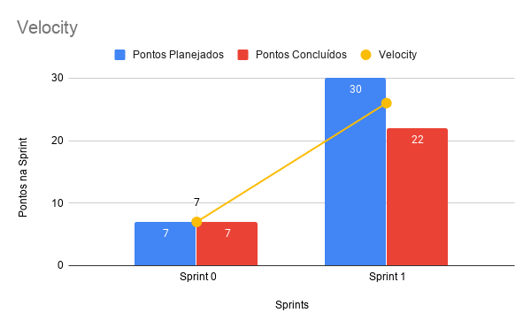

# Resultado Sprint 1

Nessa Sprint foram passados as primeiras atividades para o time de MDS e nesse meio tempo foi possível começar documentos de abertura do projeto como o Termo de Abertura de Projeto, o Roadmap do produto elaborados pelo de time de EPS que são essenciais no inicio do projeto.

## Fechamento da Sprint

| Issues | Pontos |
| ------ | ------ |
| Criar Termo de Abertura do Projeto (TAP)  | 5 |
| Criar Roadmap dos Papéis | 2 |
| Criar Roadmap do Produto | 3 |
| Criação do documento de GCS | 3 |
| Definir Licença | 1 |
| Criação do Documento de Contribuição | 2 |
| Criação do Código de Conduta | 2 |
| Criação de script para GitHub Actions | 2 |
| Criação do documento de visão | 5 |
| Estudo das tecnologias | 5 |

 

**Pontos planejados concluídos:** 30
 

## Burndown

## Velocity

## Quadro de conhecimento

    Como essa sprint foi dedicada a estudos das tecnologias por parte dos MDS, podemos ver uma pequena melhora nas tecnologias NodeJs e ReactJs que foram as tecnologias acordadas pela equipe no desenvolvimento do projeto.

### Retrospectiva

### Pontos Positivos

- Equipe está motivada
- Temos um tema definido.
- Houve o primeiro contato com as clientes.

### Pontos Negativos

- Time de EPS ainda confuso nesse primeiro momento em questão a documentação referente a liberdade da disciplina.
- Não teve uma comunicação tão fluída entre MDS e EPS.
- Houve dívidas técnicas, o que é ruim para o projeto.
- Certas atribuições dos papeis dos papeis não estão claras.

### A melhorar

- Participações nas dailys.
- Organizar melhor o tempo.
- Melhorar comunicação.
- Melhorar o seguimento dos rituais.

## Avaliação do Scrum Master

    Devido a falta de comunicação entre o time de MDS e EPS nesse primeiro momento, não conseguimos alcançar o resultado planejado pela Sprint. Sendo um ponto negativo, cujo a equipe de EPS deve melhorar, tentando aumentar ao máximo a comunicação e produtividade da equipe como todo do projeto.

    Em relação a não finalização do Roadmap do produto, podemos destacar a reunião tardia com o Cliente o que acarretou  na falta de tempo habil para o termino do documento.

    Mesmo com os pontos abordados acima e com as dívidas técnicas, foi possível verificar um aumento enorme na maturidade da equipe de EPS em relação ao projeto e ao gerênciamento da equipe. No qual a validação junto ao cliente clareou melhor a visão do produto final, o que encaminha a equipe como todo para um desenvolvimento de um produto de forma mais madura e com um foco mais preciso.

