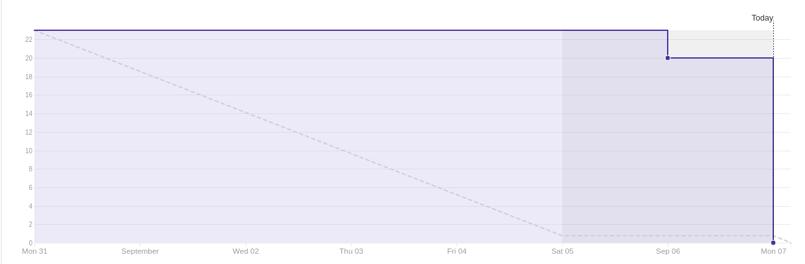
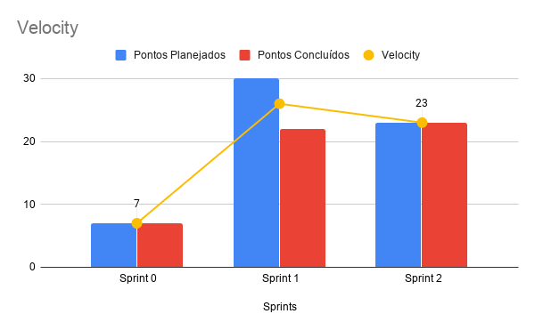
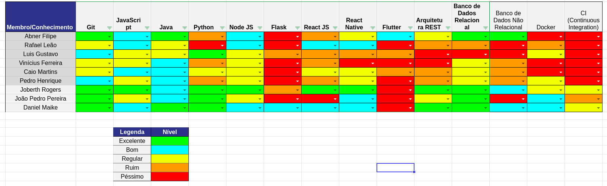

# Resultado Sprint 2

Mais uma vez tivemos uma Sprint apenas com documentação para todo o time. Documentos importantes que serão base para todo o projeto durante seu desenvolvimento. Dentre eles podemos destacar o documento de arquitetura que descreve nossa arquitetura inicial de forma bem detalhada. E a criação do backlog do produto, no qual define as histórias de desenvolvimento de um forma mais clara.

## Fechamento da Sprint

| Issues | Pontos |
| ------ | ------ |
| Treinamento e estudo de teste | 3 |
| Protótipo de Baixa Fidelidade | 3 |
| Elaboração do Documento de Arquitetura | 5 |
| Elaboração inicial do backlog do produto | 5 |
| Criação do Ambiente de Desenvolvimento | 5 |
| Elaboração do EAP | 2 |

 

**Pontos planejados concluídos:** 23
 

## Burndown

## Velocity

## Quadro de conhecimento

    Como essa sprint foi dedicada exclusivamente a documentação mais uma vez, não houve uma melhora tão grande no avanço das tecnologias, provavelmente essa melhora será explicita na proxima Sprint, já que de acordo com o Roadmap, será a primeira issue de código para o time de MDS.

### Retrospectiva

### Pontos Positivos

- Aumentou o conhecimento do time de MDS em relação a tecnologias e aos rituais da metodologia.
- melhora da comunicação entre algumas pessoas do time de MDS.
- Conhecimento em novos tipos de documentação.
- Não houve dividas técnicas.

### Pontos Negativos

- Algumas pessoas do time de MDS ainda não se comunicam o bastante, respondem as dailys, mas não são tão presentes a perguntas do time como todo.
- Dificuldades em aprender coisas novas (por parte do time de MDS), isso inclui documentação e código.
- entregas feitas muito tarde, o que poderia ter causado dividas técnicas.

### A melhorar

- Presença mais ativa de alguns membros.
- Organizar melhor o tempo.

## Avaliação do Scrum Master

    Mesmo com a entrega de todas as tarefas, senti que os membros de MDS estão um pouco desorganizados com as tarefas designadas. Eles dizem que não estão com dúvidas, mas ao entregar a documentação fica evidente o nível de clareza que entenderam sobre as issues. Nós de EPS tentamos deixar o mais claro possível que se tiverem dúvidar é necessário perguntar, de preferência nos canais gerais do slack para o sanamento das dúvidas de ambos os membros do time. 

    Outro ponto a se abordar é os ritos que continuaram a ser seguidos e ambos os membros responderam as dailys, o que mostra o comprometimento do time, mesmo sendo remoto, o que é um ponto positivo para o time.

