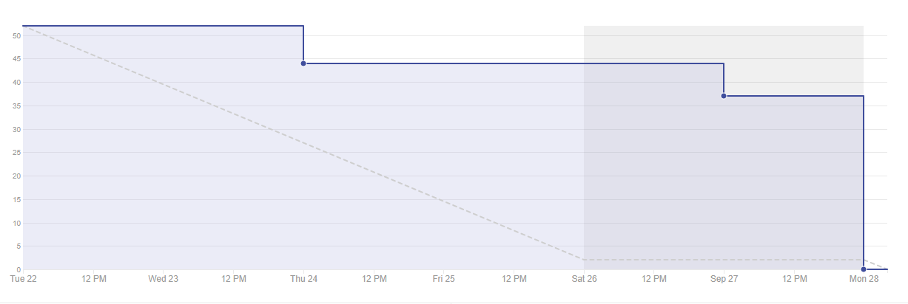
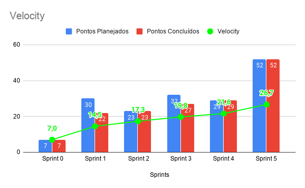
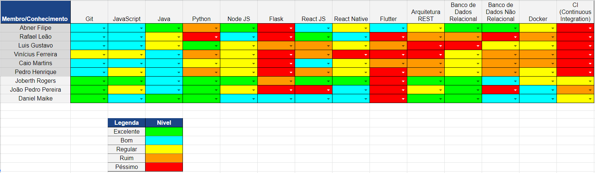

# Resultado Sprint 5

## Fechamento da Sprint

| Issues | Pontos |
| ------ | ------ |
| Configuração inicial do Deploy Continuo | 8 |
| US05 - Implementar a ficha do profissional de psicologia | 8 |
| US06 - Cadastrar o atendimento do paciente no prontuário | 8 |
| US07 - Cadastrar a disponibilidade dos profissionais de psicologia | 13 |
| Bugfix: ajustes de Design | 3 |
| Plano de custo do projeto | 5 |
| Plano de Qualidade do Projeto | 2 |
| Documentação do Pipeline de Devops | 5 |

 

**Total de pontos planejados:** 52
 

**Pontos planejados concluídos:** 52
 

## Burndown

## Velocity

## Quadro de conhecimento

   Nessa <i>sprint</i> foi possível perceber uma pequena melhora no conhecimento dos integrantes em relação as áreas de banco de dados e arquitetura REST, o que para a maioria da equipe eram áreas de maior dificuldade.

## EVM da Sprint

<iframe style="width: 100%; height: 400px;"  seamless frameborder="0" scrolling="no" src="https://docs.google.com/spreadsheets/d/e/2PACX-1vTKacsqu4_Id3fiivyQCnw7btXFrMPZ5HP8UL2cBn4Y-f7acPC6JadEeH8GHFUDzA/pubchart?oid=1008010379&amp;format=interactive"></iframe>

## Retrospectiva

### Pontos Positivos

- As issues da sprint foram completadas rapidamente.
- Os MDS conseguiram trabalhar com dedicação nas issues.
- As issues renderam e houve a passagem de conhecimento graças ao pareamento.
- O ambientes de homologação e produção foram criados com sucesso.

### Pontos Negativos

- Dificuldades no desenvolvimento do frontend.
- Dificuldade com o ReactJS.
- Dificuldade com as ferramentas da Azure, devido a inexperiência.

### A melhorar

- Seguir um padrão de css para evitar possíveis problemas de design.
- Trabalhar para entregar as issues com antecedência.
- Melhorar manutenibilidade do código e testar melhor os fluxos da aplicação antes de mandar para produção.

## Avaliação do Scrum Master

    Essa <i>sprint</i> foi marcada por um intenso aprendizado para equipe como um todo. Os integrantes de MDS estão bem mais entrosados uns com os outros e já tem um caráter técnico mínimo para realizar as atividades principais do projeto. No time de EPS é possível destacar um amadurecimento no desenvolvimento das documentações, entendimento do escopo do projeto e domínio das tecnologias de integração e entrega contínua. Também vale destacar que não houve nenhuma dívida técnica para essa <i>sprint</i> o que é bom para o planejamento previamente criado. Logo o projeto está sendo executado conforme o planejado e se continuar assim o projeto será entregue no tempo hábil.

