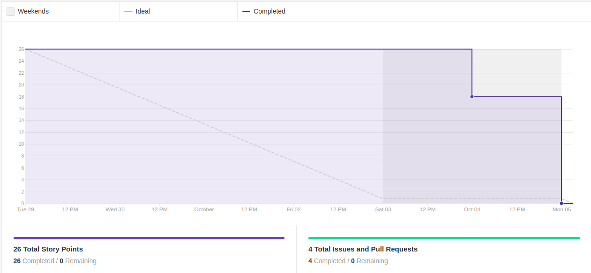
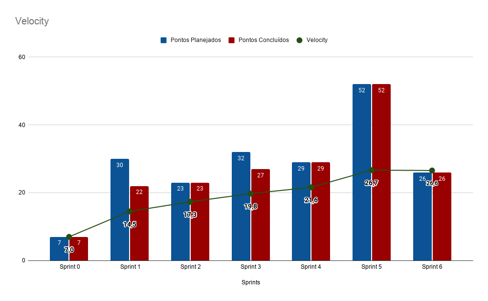

# Resultado Sprint 6

    Como essa <i>sprint</i> era uma anterior a sprint da release, o grupo resolveu focar em resolver issues de bug na aplicação do projeto e no aumento da porcentagem de cobertura dos testes do backend.

## Fechamento da Sprint

| Issues | Pontos |
| ------ | ------ |
| US08 - Implementar a consulta à ficha do profissional de psicologia | 8 |
| FIX - Melhorias de manutenibilidade, cobertura de testes e correção de bugs | 8 |
| FIX - Correções de Design | 5 |
| FIX - Melhorias na documentação do projeto | 5 |

 

**Total de pontos planejados:** 26
 

**Pontos planejados concluídos:** 26
 

## Burndown

## Velocity

## Quadro de conhecimento

   Os integrantes que mais retiveram conhecimento nessa sprint foi os membros de EPS, pois houve uma pequena evolução nos conhecimentos envolvendo DevOps.

## EVM da Sprint

<iframe style="width: 100%; height: 400px;"  seamless frameborder="0" scrolling="no" src="https://docs.google.com/spreadsheets/d/e/2PACX-1vTKacsqu4_Id3fiivyQCnw7btXFrMPZ5HP8UL2cBn4Y-f7acPC6JadEeH8GHFUDzA/pubchart?oid=939440724&amp;format=interactive"></iframe>

## Retrospectiva

### Pontos Positivos

- Trabalho evolvendo pair programming bem avaliado por integrantes de MDS.
- Membros com menor conhecimento conseguindo engajar sozinho nas issues.
- Entregas foram feitas conforme pedido nas issue e ainda mais.
- Aumento na porcentagem de teste.

### Pontos Negativos

- Sobrecarga de alguns membros das duplas, devido a tarefas de outras disciplinas.

### A melhorar

- Alguns membros serem mais proativo em questão as issues demandadas.
- Adequar alguns padrões de código no Frontend.

## Avaliação do Scrum Master

    Apesar da sobrecarga de alguns membros na <i>sprint</i>, as issues foram entregues com os requisitos especificados e com aumento na qualidade de testes e métricas de código. Houve alguns problemas em relação a padronização, pois nem todos os membros estavam seguindo padrões em relação a arquivos de CSS e outros, logo o time de gerência indicou que os membros criassem arquivos gerais para evitar a duplicação de código e para fazer aplicações automáticas de design. Outro ponto importante a destacar é a passagem de conhecimento que o DevOps do time se preocupou em passar, tanto para o time de MDS quanto para EPS, logo todos os membros tem um conhecimento minimo com a parte de conteinerização e posteriormente será passado também conhecimento sobre a estrutura do pipeline para que todos saibam o mínimo sobre como o projeto funciona até chegar na mão do usuário final.

 
    Infelizmente não foi possível entregar as histórias antes do final da sprint, pois foram levantadas muitas correções e o time de gerência bateu na tecla que o produto deveria ser entregue com a maior qualidade possível para que os stakeholder pudessem 
    ter a ideia final do produto através do mínimo produto viável (MVP) implementado até o momento.

 
    Ambos os integrantes vem crescendo constantemente e é possível ver o quanto todos estão empenhados no projeto. O conhecimento técnico está ficando balanceado entre os membros e esperamos que as próximas sprints sejam ainda melhores. 

