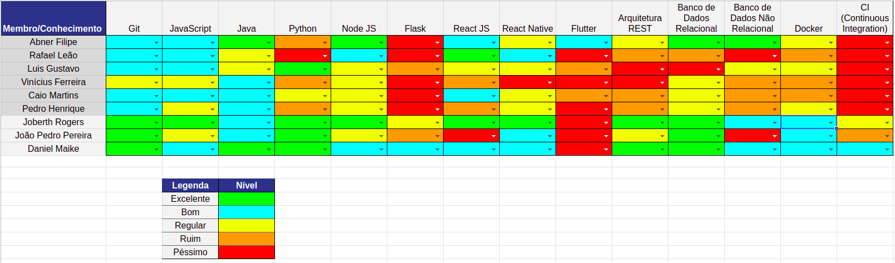

# Resultado Sprint 7

## Fechamento da Sprint

| Issues | Pontos |
| ------ | ------ |
| Melhorias na Documentação | 5 |
| Apresentação da Release | 5 |

 

**Total de pontos planejados:** 10
 

**Pontos planejados concluídos:** 10
 

## Burndown

## Velocity

## Quadro de conhecimento

   Como essa semana não foi dedicada a código, nenhum dos integrantes teve alguma melhora específica nas tecnologias listadas no quadro de conhecimento.

## Retrospectiva

### Pontos Positivos

- Tempo para colocar atividades das outra disciplina em dia.
- Melhora significativa nos documentos entregados.

### Pontos Negativos

- Modificações levantadas em cima da hora pelo professor, sobrecarga dos membros para adequar ao que foi pedido.

### A melhorar

- Não houve pontos de melhora.

## Avaliação do Scrum Master

    Essa <i>sprint</i> foi bem mais tranquila em comparação as passadas. Houve correção em grande parte dos documentos, mas houve melhoras significantes nas documentações desenvolvidas no decorrer do semestre até o momento atual, isso inclui correções ortográficas e correções e adaptações de tópicos. As atividades foram desenvolvidas em tempo hábil, mas o vídeo da apresentação foi entregue no tempo do deadline, devido a refatorações feitas em cima da hora. A priori todas as atividades foram entregues com exito em mais uma <i>sprint</i>.

