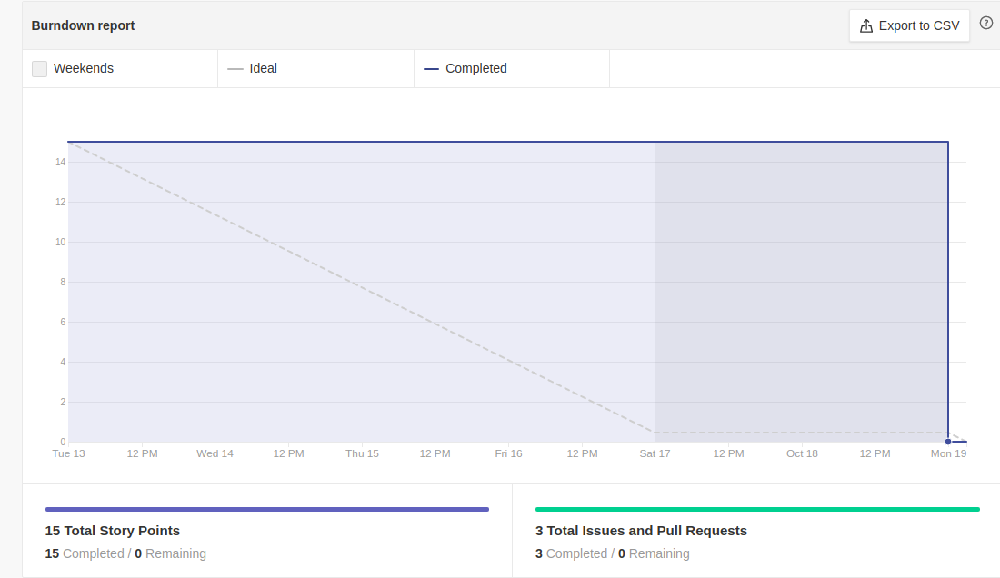
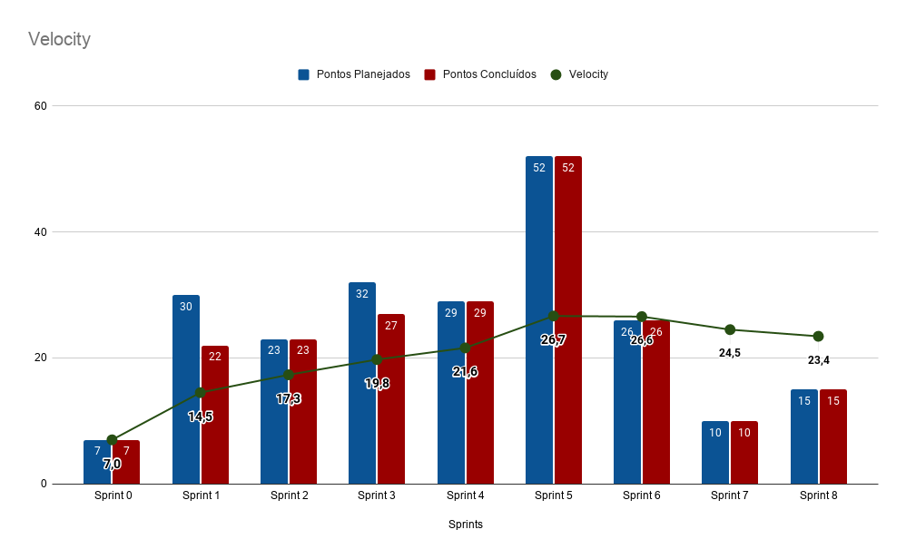

# Resultado Sprint 8

    Como não houve feedback do professor sobre a primeira release do projeto, nós do time de EPS, optamos por separar issues de pequenas melhorias, para o time de EPS.

## Fechamento da Sprint

| Issues | Pontos |
| ------ | ------ |
| BUGFIX - Melhoria de código e design do front-end | 5 |
| BUGFIX - Melhorias de código do back-end | 5 |
| Criar o EVM do projeto | 5 |

 

**Total de pontos planejados:** 15
 

**Pontos planejados concluídos:** 15
 

## Burndown

## Velocity

## Quadro de conhecimento

   O quadro de conhecimento desde a <i>sprint</i> passada não houve qualquer mudanças, como as issues foram particularmente de <i>BUGFIX</i>, não havia novas opções para que o time de MDS pudesse explorar, logo o quadro de conhecimento foi mantido.

## EVM da Sprint

<iframe style="width: 100%; height: 400px;"  seamless frameborder="0" scrolling="no" src="https://docs.google.com/spreadsheets/d/e/2PACX-1vTKacsqu4_Id3fiivyQCnw7btXFrMPZ5HP8UL2cBn4Y-f7acPC6JadEeH8GHFUDzA/pubchart?oid=756327297&amp;format=interactive"></iframe>

## Retrospectiva

### Pontos Positivos

- Issue mais tranquila que uma User Story e todos os bugs foram corrigidos.
- As issues estão sendo entregues, o pessoal se empenhou.

### Pontos Negativos

- Não conseguimos planejar muito bem a semana passada devido o feriado no dia da reunião. (EPS)

### A melhorar

- Melhorar a integração de todos os membros de EPS.
- Planejar melhor o tempo e também a integração de todos os membros.

## Avaliação do Scrum Master

    Novamente todas as <i>issues</i> programadas foram entregues com exito nessa  <i>sprint</i>, foram levantadas algumas issues para correção de design e correção de erros apontados pela ferramenta Code Climate. Outra issue importante entregue foi a da criação da documentação de valor agregado do projeto, que agora está disponível na Wiki do projeto. Nessa semana, alguns membros não estiveram totalmente presentes na <i>sprint</i> devido a atividades diversas, mas foi levantado como pontos de melhoria para próximas <i>sprint</i> a melhorar na divisão das tarefas entre os membro de EPS e MDS, de forma a evitar a sobrecarga dos integrantes dentro do time.

