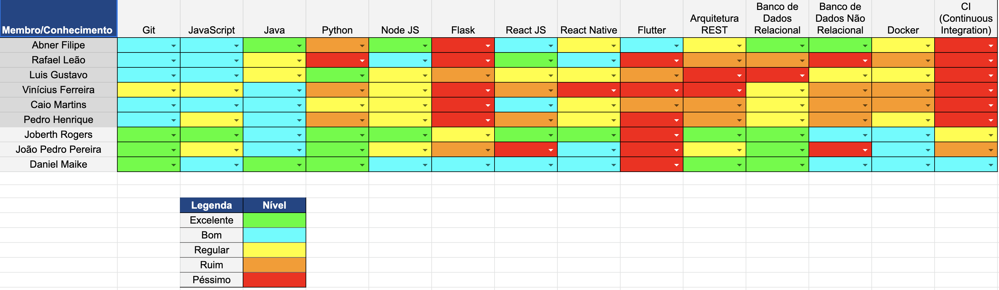

# Resultado Sprint 9

    Sprint focada em histórias de usuário para fazer o fluxo de agendamento de consultas e também salvamento de foto de usuários, e dar cara ao produto com uma landing page.

## Fechamento da Sprint

| Issues | Pontos |
| ------ | ------ |
| US09 - Implementação do salvamento e visualização das fotos dos usuários paciente e psicólogo | 8 |
| US10 - Implementação do agendamento de consulta pelos pacientes | 13 |
| US11 - Criação da Landing Page da plataforma | 5 |

 

**Total de pontos planejados:** 26
 

**Pontos planejados concluídos:** 13
 

## Burndown

## Velocity

## Quadro de conhecimento

## EVM da Sprint

<iframe style="width: 100%; height: 400px;"  seamless frameborder="0" scrolling="no" src="https://docs.google.com/spreadsheets/d/e/2PACX-1vTKacsqu4_Id3fiivyQCnw7btXFrMPZ5HP8UL2cBn4Y-f7acPC6JadEeH8GHFUDzA/pubchart?oid=70119389&amp;format=interactive"></iframe>

## Retrospectiva

### Pontos Positivos

- O pessoal de mds está melhorando o poder de decisão, procurando o melhor caminho.
- Mesmo com a dificuldade do pessoal de MDS ainda conseguiram entregar issues.

### Pontos Negativos

- Sobrecarga de outras matérias, com muitas entregas juntas.
- A demora para entregar as issues, que está levando a um dia de perca da sprint.

### A melhorar

- Melhorar a integração de todos os membros de EPS.
- Melhorar o tempo de entrega das issues, para melhor revisão. 
- Melhorar o cuidado com nome de variáveis dentro do código.
- Conciliar melhor as disciplinas.

## Avaliação do Scrum Master

    Duas das três <i>issues</i> foram entregues, os desenvolvedores tiveram algumas dificuldades e aconteceu que uma <i>issue</i> se tornou dívida técnica e a mesma equipe vai dar continuidade e seguir com a <i>issue</i> que viria em seguida e dependia da mesma.
    Os membros de MDS estão melhorando o poder de decisão a respeito de melhorias no código, e sempre procurando o melhor caminho para desenvolver as <i>features</i>. A dificuldade com as disciplinas estão cada vez maiores, com provas e trabalhos para mesmas datas, e a equipe está tendo que adequar o planejamento para trabalhar com estes riscos.

