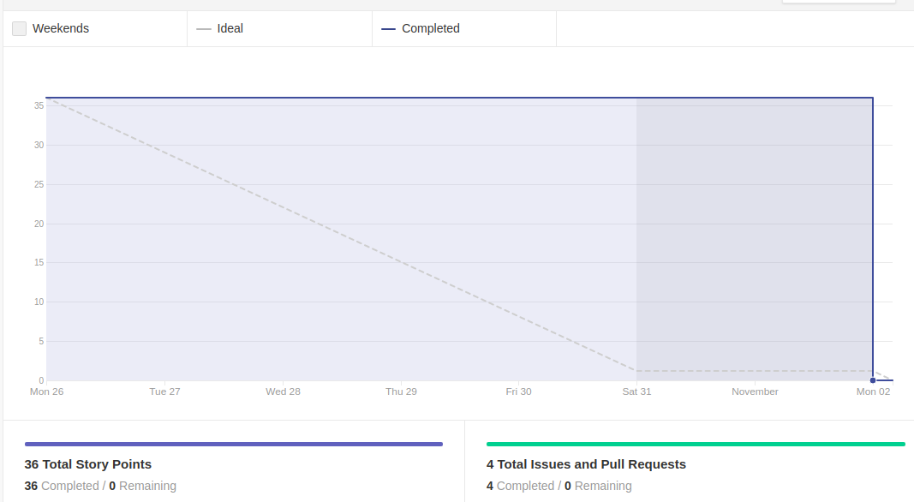

# Resultado Sprint 10

    Nessa <i>sprint</i> o time resolveu implementar <i>issues</i> para complementar as parte de Login e Registro dentro da plataforma com com a implementação da autenticação usando OAuth e continuação das histórias de usuário da parte de consultas e agendamento dos usuários.

## Fechamento da Sprint

| Issues | Pontos |
| ------ | ------ |
| US10 - Implementação do agendamento de consulta pelos pacientes | 13 |
| FIX - Melhoria do Protótipo de Alta Fidelidade | 5 |
| US12 - Implementação da visualização das consultas agendadas | 5 |
| US13 - Implementação da autenticação dos usuários | 13 |

 

**Total de pontos planejados:** 36
 

**Pontos planejados concluídos:** 36
 

## Burndown

## Velocity

## Quadro de conhecimento

## EVM da Sprint

<iframe style="width: 100%; height: 400px;" seamless frameborder="0" scrolling="no" src="https://docs.google.com/spreadsheets/d/e/2PACX-1vTKacsqu4_Id3fiivyQCnw7btXFrMPZ5HP8UL2cBn4Y-f7acPC6JadEeH8GHFUDzA/pubchart?oid=703711915&amp;format=interactive"></iframe>

## Retrospectiva

### Pontos Positivos

- Alguns integrantes cresceram em questão a conhecimentos de frontend.
- Aumentou o conhecimento dos integrantes sobre autenticação.
- Alto empenho dos integrantes de MDS.

### Pontos Negativos

- Escopo da *issue* de implementação do agendamento das consultas não estava muito fechado e que atrapalhou no desenvolvimento.
- Problema familiares de alguns integrantes sobrecarregou outros integrantes.
- Testes quebraram.
- Acumulo de atividades de outras disciplinas.
- Integrantes de EPS não estavam muito disponíveis essa sprint.

### A melhorar

- Nenhum ponto de melhoria.

## Avaliação do Scrum Master

    Essa <i>sprint</i> foi atípica para os integrantes de EPS, pois muitos de nós estávamos com sobrecarga em outra matérias e alguns PR demoraram para ser corrigidos no tempo hábil. Por outro lado os integrantes de MDS procuraram muito pouco nós de EPS para tirar dúvidas, tendo apenas dúvidas em relação ao escopo, o que mostra um alto nível de maturidade desses integrantes e evidencia um ponto posítivo para o termino do escopo no tempo planejado, já que os integrantes estão entrando em sintonia em relação ao projeto.

    Vale destacar também que tivemos um novo encontro com as clientes do projeto, onde houve muitos feedbacks bons por parte delas. Houve algumas observações em relação a design e muitas dúvidas sobre o fluxo da aplicação foram sanadas. As cliente pediram para incluir a implementação de uma fila de espera dentro da plataforma e pequenas correções no design foram levantadas. Logo, estamos no caminho certo em relação as expectativas do cliente, o que é um ponto muito positivo para o time.

