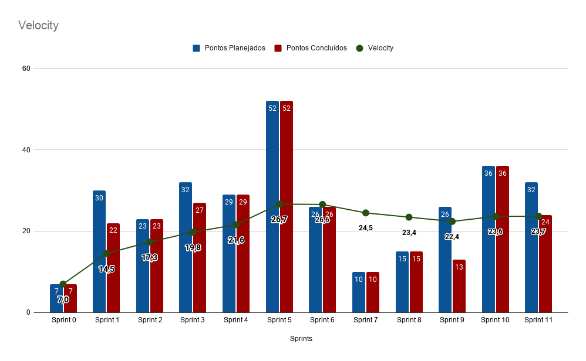
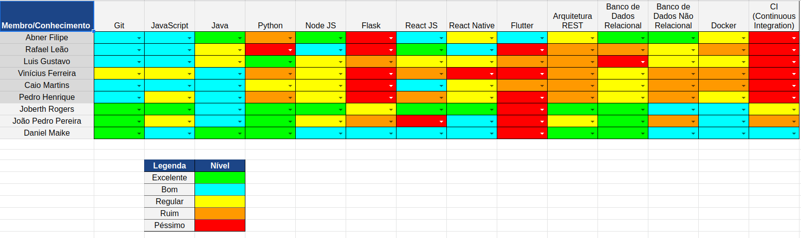

# Resultado Sprint 10

    Nessa <i>sprint</i> o time resolveu implementar <i>issues</i> para complementar as parte de Login e Registro dentro da plataforma com com a implementação da autenticação usando OAuth e continuação das histórias de usuário da parte de consultas e agendamento dos usuários.

## Fechamento da Sprint

| Issues | Pontuação | Responsáveis |
| ------ | ------ | --------|
| <a href="https://github.com/fga-eps-mds/2020.1-eSaudeUnB-Wiki/issues/98">US14 - Implementação da lista de espera</a> | 8 | Rafael e Abner |
| <a href="https://github.com/fga-eps-mds/2020.1-eSaudeUnB-Wiki/issues/100">FIX - Corrigir a visualização das consultas agendada</a> | 3 | Luís e Vinicius |
| <a href="https://github.com/fga-eps-mds/2020.1-eSaudeUnB-Wiki/issues/103">FIX - Atualizando EVM para Agile EVM </a> | 8 | Joberth Rogers |
| <a href="https://github.com/fga-eps-mds/2020.1-eSaudeUnB-Wiki/issues/95">FIX - Corrigir os testes da autenticação</a> | 5 | Luís e Vinicius |
| <a href="https://github.com/fga-eps-mds/2020.1-eSaudeUnB-Wiki/issues/101">FIX - Implementar as mudanças feitas no protótipo de alta fidelidade</a> | 8 | Caio e Pedro |

 

**Total de pontos planejados:** 32
 

## Dívidas técnicas

| Issues | Pontuação | Responsáveis |
| ------ | ------ | --------|
| <a href="https://github.com/fga-eps-mds/2020.1-eSaudeUnB-Wiki/issues/98">US14 - Implementação da lista de espera</a> | 8 | Rafael e Abner |

**Pontos planejados concluídos:** 24
 

## Burndown

## Velocity

## Quadro de conhecimento

## EVM da Sprint

<iframe style="width: 100%; height: 400px;" seamless frameborder="0" scrolling="no" src="https://docs.google.com/spreadsheets/d/e/2PACX-1vTKacsqu4_Id3fiivyQCnw7btXFrMPZ5HP8UL2cBn4Y-f7acPC6JadEeH8GHFUDzA/pubchart?oid=1654714464&amp;format=interactive"></iframe>

## Retrospectiva

### Pontos Positivos

- As coisas saíram como esperado, foram feitas mudanças significativas e necessárias no front-end.
- Os testes foram resolvidos.
- As duplas trabalharam bem.
- Estamos chegando ao fim, e recebendo feedbacks positivos.
- A equipe de MDS está se tornando mais independente.

### Pontos Negativos

- Demora com a correção do Pull Request.
- Dificuldade com a issue, e uma dívida técnica.
- Demora com a realização da issue.
- Demora do feedback da release 1.

### A melhorar

-  Mais dedicação de EPS, houve um descontrole com outras matérias.

## Avaliação do Scrum Master

    Com o feedback das clientes na <i>sprint</i> passada foi alocada a <i>issue</i> de implementação da fila de espera no eSaude UnB, infelizmente ela não foi completada e virou dívida técnica devido a problemas com testes e a funcionalidade. Além do mais alguns Bugs foram consertados e agora o projeto está mais estável, pois vários desses Bugs levantados eram em funcionalidades essenciais dentro da plataforma, por isso foram colocados como prioridade nessa <i>sprint</i>.

    Outra mudança planejada, foi a atualização no documento de EVM do projeto, onde foi refatorado para EVM Agile, se adequando a metodologia usada no projeto. Tirando o empecilho com a <i>issue</i>  da fila de espera, todas as demais foram entregues com exito. Estamos na reta final de trabalho, mas ainda há muito o que ser desenvolvido, dessa forma nós de EPS estamos tentando motivar todo o grupo de MDS a continuar entregando no ritmo, para que o produto final seja entregue como esperado. Além do mais recebemos o feedback referente a release 1, logo estamos tentando adequar os pontos levantados pelo professor ao nosso projeto, para garantir as melhores entregas pelo time como todo.

