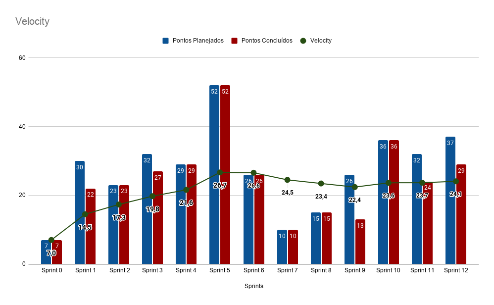

# Resultado Sprint 12

## Fechamento da Sprint

| Issues | Pontuação | Responsáveis |
| ------ | ------ | --------|
| <a href="https://github.com/fga-eps-mds/2020.1-eSaudeUnB-Wiki/issues/98">US14 - Implementação da lista de espera</a> | 8 | Rafael e Abner |
| <a href="https://github.com/fga-eps-mds/2020.1-eSaudeUnB-Wiki/issues/105">FIX - Corrigir a responsividade da plataforma</a> | 8 | Caio e Rafael |
| <a href="https://github.com/fga-eps-mds/2020.1-eSaudeUnB-Wiki/issues/106">US15 - Configurar o envio de e-mails e implementar o envio de e-mail com a senha dos usuários profissionais de psicologia</a> | 8 | Vinícius e Luís |
| <a href="https://github.com/fga-eps-mds/2020.1-eSaudeUnB-Wiki/issues/107">US16 - Implementar a modificação de senha dos usuários</a> | 5 | Rafael e Abner |
| <a href="https://github.com/fga-eps-mds/2020.1-eSaudeUnB-Wiki/issues/113">Configurar o sonarqbe do projeto</a> | 8 | Daniel, Joberth e João Pedro |

 

**Total de pontos planejados:** 37
 

## Dívidas técnicas

| Issues | Pontuação | Responsáveis |
| ------ | ------ | --------|
| <a href="https://github.com/fga-eps-mds/2020.1-eSaudeUnB-Wiki/issues/113">Configurar o sonarqbe do projeto</a> | 8 | Daniel, Joberth e João Pedro |

**Pontos planejados concluídos:** 29
 

## Burndown

## Velocity

## Quadro de conhecimento

## EVM da Sprint

<iframe style="width: 100%; height: 400px;" seamless frameborder="0" scrolling="no" src="https://docs.google.com/spreadsheets/d/e/2PACX-1vTKacsqu4_Id3fiivyQCnw7btXFrMPZ5HP8UL2cBn4Y-f7acPC6JadEeH8GHFUDzA/pubchart?oid=291499854&amp;format=interactive"></iframe>

## Retrospectiva

### Pontos Positivos

- Empenho aumentou nessa sprint.
- Apesar de algumas críticas o projeto foi bem visto pelo professor na primeira release.

### Pontos Negativos

- Alguns membros de MDS tiveram grandes imprevistos durante a sprint o que atrasou o começo de algumas issues.
- Alguns testes não estavam funcionando o que acarretou em algumas mudanças bruscas no projeto.
- Reunião com as clientes colocou o time em apuros, já que estamos com dificuldade sobre o que priorizar para entregar a tempo da release 2.

### A melhorar

-  Calcular melhor o tempo durante a semana, pois algumas issues quase viraram divida técnica (MDS).

## Avaliação do Scrum Master

    O feedback das clientes desde a <i>sprint</i> passada deixou o time todo muito apreensivo, já que as mudanças levantadas por elas são bruscas dentro do ROADMAP, o que pode acarretar na entrega incompleta desse primeiro MVP para uso final. Nas primeiras reuniões as clientes tinham em vista o atendimento remoto com os pacientes, e, depois da reunião passada, a mentalidade para funcionalidades estavam focadas no retorno presencial, o que confundiu tanto o time de EPS quanto MDS nesse primeiro momento. O time de EPS está buscando a melhor solução para a situação atual e pretende fazer reuniões tanto com as clientes quanto com o professor Hilmer para tomar um decisão final para as próximas <i>sprints</i> até a release 2.  

    Foi também pedida pelo professor Hilmer a implementação da ferramenta sonarQube para monitoramento da qualidade de código das <i>features</i> entregues pelo time. Foi alocado como uma <i>issue</i> para essa <i>sprint</i>, mas, depois de uma reunião com professor, foi discutido um outro foco para essa ferramenta mudando este para para monitorar cada release desde a implantação completa do CI/CD. Tirando esta <i>issue</i> que será implementada na próxima <i>sprint</i> para complementar o pipeline do projeto, todas as <i>issues</i> restantes foram entregues, por mais que em cima da hora. O time está evoluindo cada vez mais, tanto em maturidade de gerência quanto código. Apesar da situação encontrada, estamos com bom pressentimento com relação ao projeto e esperamos entregar o produto mínimo e viável para a disciplina. 

