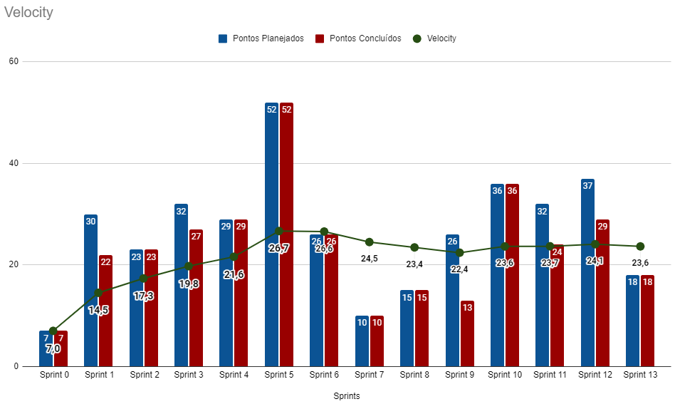

# Resultado Sprint 12

## Fechamento da Sprint

| Issues | Pontuação | Responsáveis |
| ------ | ------ | --------|
| <a href="https://github.com/fga-eps-mds/2020.1-eSaudeUnB-Wiki/issues/110">FIX - Refatoração do cadastro do usuário profissional</a> | 5 | Caio e Vinícius |
| <a href="https://github.com/fga-eps-mds/2020.1-eSaudeUnB-Wiki/issues/111">FIX - Refatoração do cadastro do usuário paciente</a> | 5 | Pedro e Rafael |
| <a href="https://github.com/fga-eps-mds/2020.1-eSaudeUnB-Wiki/issues/112">FIX - Correções diversas</a> | 8 | Abner e Luís |
 

**Total de pontos planejados:** 18
 

**Pontos planejados concluídos:** 18
 

## Burndown

## Velocity

## Quadro de conhecimento

## EVM da Sprint

<iframe width="600" height="371" seamless frameborder="0" scrolling="no" src="https://docs.google.com/spreadsheets/d/e/2PACX-1vTKacsqu4_Id3fiivyQCnw7btXFrMPZ5HP8UL2cBn4Y-f7acPC6JadEeH8GHFUDzA/pubchart?oid=2048029573&amp;format=interactive"></iframe>

## Retrospectiva

### Pontos Positivos

- As duplas conseguiram trabalhar bem e até fizeram o pull request de uma das <i>issues</i> antes do final, o que facilitou na revisão.

### Pontos Negativos

- Alguns bugs foram detectados pelos membros de EPS.

### A melhorar

-  Intensificar o trabalho no projeto para poder entregar um produto ao final da disciplina.

## Avaliação do Scrum Master

    Na última reunião com as clientes foram solicitadas modificações para que a plataforma pudesse ser utilizada quando os atendimentos presenciais fossem retomados. Tais mudanças começaram a ser implementadas nessa <i>sprint</i> para que possamos entregar um produto que ajude as clientes a realizar tanto os atendimentos remotos quanto os presenciais. Para isso tivemos que modificar o nosso planejamento para nos adequar a essas alterações, o que consumiu um pouco de tempo dos membros de EPS e gerou um certo receio da equipe de MDS sobre a entrega e os prazos por conta dos prazos das outras disciplinas.

