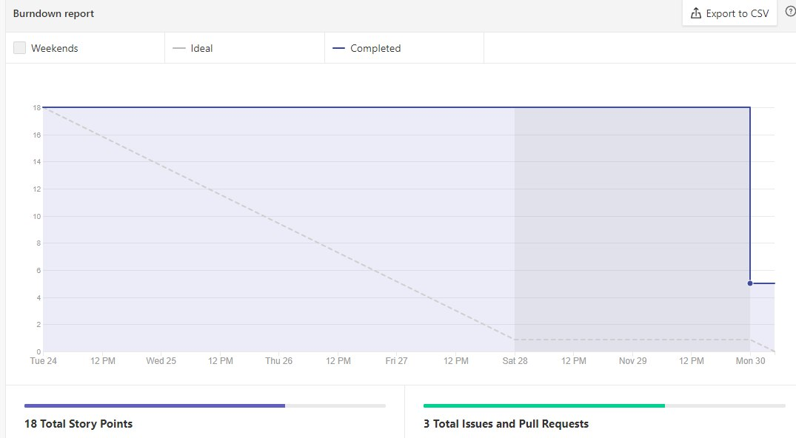
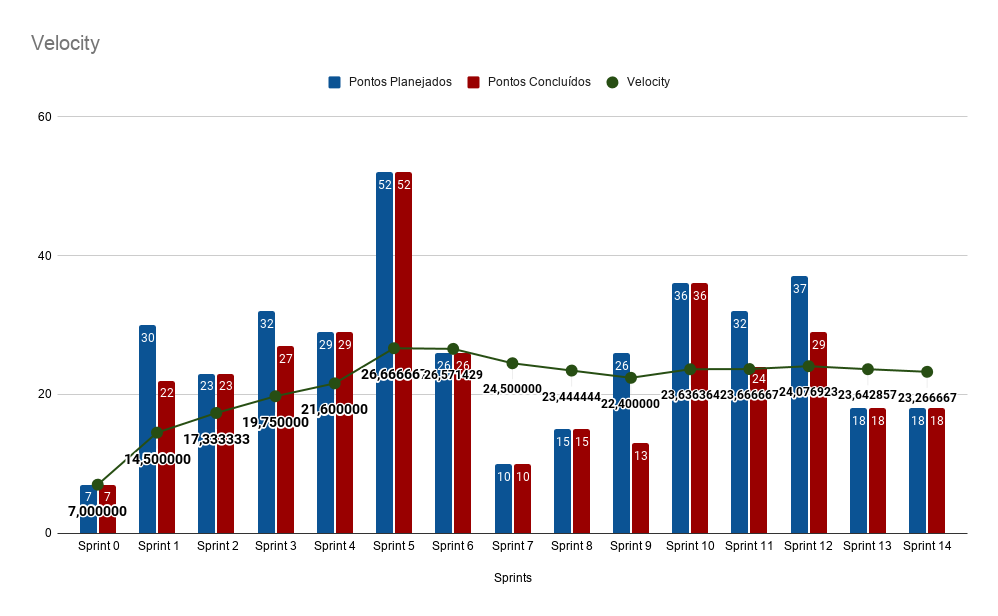

# Resultado Sprint 14

## Fechamento da Sprint

| Issues | Pontuação | Responsáveis |
| ------ | ------ | --------|
| <a href="https://github.com/fga-eps-mds/2020.1-eSaudeUnB-Wiki/issues/121">US17 - Implementar a recuperação da senha</a> | 5 | Luís e Rafael |
| <a href="https://github.com/fga-eps-mds/2020.1-eSaudeUnB-Wiki/issues/122">FIX - Finalizar a correção da responsividade da plataforma</a> | 8 | Caio e Pedro |
| <a href="https://github.com/fga-eps-mds/2020.1-eSaudeUnB-Wiki/issues/116">FIX - Modificação evolutiva da disponibilidade dos profissionais</a> | 5 | Abner e Vinícius |
 

**Total de pontos planejados:** 18
 

**Pontos planejados concluídos:** 18
 

## Burndown

## Velocity

## Quadro de conhecimento

## EVM da Sprint

<iframe width="600" height="371" seamless frameborder="0" scrolling="no" src="https://docs.google.com/spreadsheets/d/e/2PACX-1vTKacsqu4_Id3fiivyQCnw7btXFrMPZ5HP8UL2cBn4Y-f7acPC6JadEeH8GHFUDzA/pubchart?oid=1089958705&amp;format=interactive"></iframe>

## Retrospectiva

### Pontos Positivos

- Uma dupla terminou a issue cedo, o que deu mais tempo para fazer o merge dela com a develop.
- As duplas estão conseguindo resolver as pendências

### Pontos Negativos

- Duas duplas tiveram dificuldade de fazer o pareamento.
- Uma dupla começou tarde a trabalhar na issue.

### A melhorar

-  Começar a trabalhar na issue mais cedo.
-  Relatar mais os <i>bugs</i> encontrados na plataforma para que eles possam ser resolvidos.

## Avaliação do Scrum Master

    O final do semestre começou a pesar para todos os integrantes da equipe, tanto de MDS quanto de EPS. Os prazos de entrega das atividades de outras disciplinas e o tempo que os integrantes precisam estudar para as provas de outras disciplinas tem atrapalhado na hora de conseguir marcar os horários de pareamento. Apesar disso, as duplas têm conseguido se comunicar e dividir as tarefas para entregar as <i>issues</i> ao final da <i>sprint</i>.

