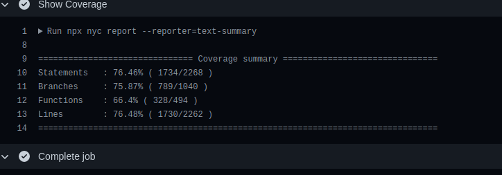

# Testes Funcionais

    Para incrementar a suíte de teste dentro da aplicação, foi implementado testes end to end (Ponta a Ponta) ou testes funcionais no repositório Frontend do projeto. Para ajudar a chegar nesse objetivo, foi usado a ferramenta Cypress para execução e desenvolvimento dos testes. A decisão para escolha dessa ferramenta foi a ótima documentação presente em sua Wiki, a forma fácil de implementação e execução de seus processo. Além do mais a ferramenta é compatível com todo ecossistema javascript, não baseando em apenas em uma Stack como é o caso do ReactJS.  

    Para executar os testes funcionais no pipeline foi usado a ferramenta de orquestração de workflows Github Actions, essa verificação é acionada a cada vez que um Pull Request é criado dentro do repositório Frontend do Esaúde-Unb. A seguinte figura mostra o workflow até chegar na etapa de verificação dos testes.  

    Atualmente o coverage de testes está em 76%, não foi possível chegar ao coverage máximo devido ao tempo que resta da disciplina, mas os teste desenvolvidos cobrem mais da metade dos casos o que é um ponto positivo para teste na camada de usuário.

](img/test_e2e.png)

    Na figura abaixo é possível verificar uma das builds com o pipeline de testes funcionais no repositório: <a href="https://github.com/fga-eps-mds/2020.1-eSaudeUnB-FrontEnd/actions/runs/419692338">link</a>

## Features que os testes cobrem

 - Login do usuário Admin
 - Criação de um Psicólogo
 - Tratamento de erros na aplicação
 - Listagem de Psicólogos
 - Filtragem de listas
 - Login e Registro do usuário Paciente
 - Gerênciamento das consultas de Psicólogos e Pacientes
 - Edição e Rendenrização das informações de pacientes e psicólogos

## Exemplo de como os testes são executados

